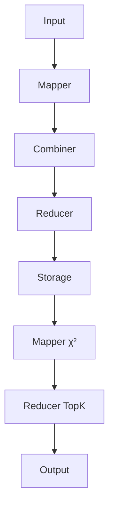

<!--
presentation should follow **req12** from ./requirements/Requirements.md
target is PDF after css application to .md
-->
# 194.048 Data-intensive Computing 2026S
Task 1 Group 58: Tomilin Evgenii ,Sajan Sonu, Puthumana Kudiyirikkal Neeraj, Taikandi Mohammed Muhammed Musthaq, Krishnan Karun

## 1. Intro

Task focuses on high volume text processing using MapReduce applied to Amazon Reviews dataset. Objective is extraction of discriminative unigram features per product category using chi-square statistic.\
Dataset scale (~56GB) _requires_ distributed computation it will take significant time est. 7-9 hours for my laptop. Implementation uses mrjob per task requirement and targets LBD Hadoop cluster.

## 1.1 Observations
Dataset is not clean. JSON parsing is fine, data itself confusing. There are definitely misspelled like :  accessorie, kitche, garde, supplie, faotd, apos, hea, quot; as well 'keyboard sleep' tokens like yhbvgyhnnkoongdrtcswwxxdghnnjuuhhhj.

## 2. Problem Overview

Preprocessing requirements:
- Tokenization to unigrams
- Case folding
- Stopword filtering
- Remove single-character tokens

Tasks:
- Compute chi-square per term per category
- Keep top 75 terms per category
- Merge into global dictionary

Output:
- Per-category ranked terms
- One merged dictionary line

## 3. Methodology and Approach

### 3.1 Chi-square

χ² = N * (N11·N00 − N10·N01)² / ((N11+N01)(N11+N10)(N10+N00)(N01+N00))

### 3.2 Pipeline

Stage 1: CountStatsJob  
Stage 2: ScoreTopKJob  
Stage 3: Output merge

### 3.3 Key–Value Design

- ("N", 1)
- ("NC", category)
- ("NT", term)
- ("NTC", category, term)

### 3.4 Efficiency

- Combiner
- Deduplication
- Heap top-k

### 3.5 Pipeline Diagram

---

## 4. Conclusions

All requirements satisfied. Efficient and scalable design.