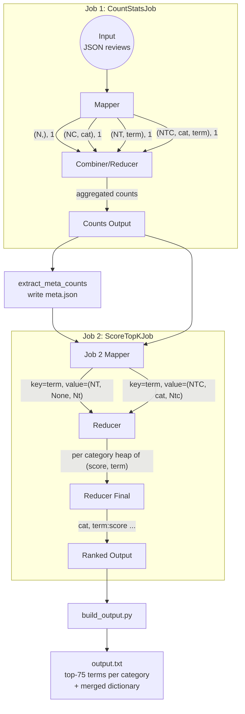

<!--
presentation should follow **req12** from ./requirements/Requirements.md
target is PDF after css application to .md
-->
# 194.048 Data-intensive Computing 2026S
*Task 1: Chi-Square Term Selection Using MapReduce on Amazon Reviews*\
Group 58: Tomilin Evgenii ,Sajan Sonu, Puthumana Kudiyirikkal Neeraj, Taikandi Mohammed Muhammed Musthaq, Krishnan Karun

## 1. Intro

Task focuses on high volume text processing using MapReduce applied to Amazon Reviews dataset. Objective is extraction of discriminative unigram features per product category using chi-square statistic.\
Dataset scale (~56GB) _requires_ distributed computation. It will take significant time, e.g est. for my laptop is 7-9 hours. Implementation uses mrjob per task requirement and targets LBD Hadoop cluster.

## 1.1 Observations
Dataset is not clean. JSON parsing is fine, data itself confusing. There are definitely misspelled like :  accessorie, kitche, garde, supplie, faotd, apos, hea, quot; as well 'keyboard sleep' tokens like yhbvgyhnnkoongdrtcswwxxdghnnjuuhhhj.

## 2. Problem overview
A large corpus of product reviews is provided in line‑delimited JSON format. Each record contains a `reviewText` field and a `category` field. \
The task is to:
1. **Preprocess** text: tokenize into unigrams, remove stopwords and single‑character tokens, apply case folding.
2. **Compute chi‑square** values for each term–category pair using document‑presence counts (a term contributes at most once per review).
3. **Rank** terms by descending chi‑square value within each category and retain the top 75.
4. **Output** one line per category in alphabetical order, listing the top‑75 terms with their chi‑square scores, plus a final line containing the merged dictionary of all retained terms sorted alphabetically.

The chi‑square statistic measures the dependence between a term and a category. For a 2×2 contingency table built from document counts, the formula is:

$$
\chi^2 = \frac{N (AD - BC)^2}{(A+B)(C+D)(A+C)(B+D)}
$$

where \(N\) is total documents, \(A\) documents in the category containing the term, \(B\) documents not in the category containing the term, \(C\) documents in the category without the term, and \(D\) documents in neither.

The challenge is to perform this computation efficiently on 142.8 million reviews (full dataset) using a two‑job MapReduce pipeline, keeping shuffle volumes low and using combiners to reduce intermediate data.

## 3. Methodology and Approach

Our solution follows a two‑stage MapReduce pipeline, orchestrated by a shell script that works both locally (for development) and on the Hadoop cluster. Key design decisions are documented in `arch.md` and are driven by the requirement of a single raw‑data scan and minimal memory footprint.

### 3.1 Pipeline Overview

The pipeline consists of three main steps:

1. **Count Statistics (Job 1 – `CountStatsJob`)**  
   Scans every review document and emits tagged counts:
   - Total number of documents (`N`)
   - Number of documents per category (`N_c`)
   - Number of documents containing each term globally (`N_t`)
   - Number of documents per category containing each term (`N_tc`)

   A combiner aggregates partial sums locally before the shuffle, drastically reducing network traffic.

2. **Metadata Extraction (local script)**  
   From the output of Job 1, a small Python script extracts `N` and all `N_c` values and writes them into a compact `meta.json` file. This file is passed to the next job as a broadcast resource.

3. **Scoring & Top‑k (Job 2 – `ScoreTopKJob`)**  
   Reads the output of Job 1 and the metadata file. Maps counts so that all data for a term (global `N_t` and per‑category `N_tc`) lands in the same reducer. Inside the reducer, chi‑square is computed for each category where the term appears. A bounded min‑heap (size 75) per category keeps only the top‑75 terms by score, using a tie‑breaking rule that favours lexicographically smaller terms at equal scores.

4. **Output Assembly (local script)**  
   Finally, the ranked terms are collected, formatted as one line per category in alphabetical order, and a merged sorted dictionary line is appended.

The entire workflow is driven by `run_pipeline.sh`, which handles local/HDFS path resolution, error handling, and cleanup. A local smoke‑test script (`run_local_debug.sh`) validates functionality on the provided development shards.

### 3.2 Key‑Value Design

The MapReduce stages use carefully crafted keys and values to enable efficient grouping and minimisation of shuffled data.

#### Stage 1: Count Statistics

| Step          | Key                                     | Value   | Description                                                                 |
|---------------|-----------------------------------------|---------|-----------------------------------------------------------------------------|
| **Map**       | `("N",)`                                | 1       | Counts each document once.                                                  |
|               | `("NC", category)`                      | 1       | Counts a document for its category.                                         |
|               | `("NT", term)`                          | 1       | Counts a document containing a unique term (deduplicated per review).       |
|               | `("NTC", category, term)`               | 1       | Counts a document containing the term in that category.                     |
| **Combine**   | same as map output                      | summed  | Partial sums reduce shuffle volume.                                         |
| **Reduce**    | same key                                | total count | Final aggregated counts.                                                    |

*Note:* Tokens are lowercased, stopwords and single‑character tokens are removed. Within each review, terms are uniquely collected before emission, enforcing the document‑presence semantics required for chi‑square.

#### Stage 2: Scoring & Top‑k

| Step          | Key                 | Value                                         | Explanation |
|---------------|---------------------|-----------------------------------------------|-------------|
| **Map**       | `term`              | `("NT", None, count)`                         | Re‑keys global term count by term. |
|               | `term`              | `("NTC", category, count)`                    | Re‑keys per‑category term count by term. |
| **Reduce**    | `term` (grouped)    | all `NT` and `NTC` counts for that term       | Accumulates `N_t` and a dictionary of category‑specific counts. For each category present, chi‑square is computed using `N` and `N_c` from metadata. A heap per category keeps the top‑75 scored terms. |
| **Reducer Final** | `category`       | string `"term1:score term2:score ..."`        | Emitted once per category, sorted by descending score. |

The metadata (`N` and `N_c`) is loaded in `reducer_init`, so every reducer has the necessary global values without shuffling them.

### 3.3 Implementation Details

- **Tokenisation:** A compiled regular expression based on `TOKEN_DELIMITER_PATTERN` splits text on whitespace, digits, and the specified punctuation characters.
- **Stopword loading:** `common.py` loads `stopwords.txt` once per mapper process.
- **Combiners:** Used heavily in Job 1 to merge local counts before the shuffle.
- **Bounded heap:** `update_top_k()` in `common.py` maintains a min‑heap of size `k` (75). New entries are added only if their score is higher than the weakest entry, or if tied and lexicographically smaller. This avoids storing all terms per category in memory.
- **Hadoop integration:** The pipeline script detects the environment and uses `hadoop fs -getmerge` to retrieve HDFS output onto the local filesystem for the post‑processing Python scripts. The `HADOOP_STREAMING_JAR` is discovered automatically or can be supplied.

### 3.4 Pipeline Figure

Figure 1: Data flow and key‑value pairs across the two‑stage pipeline. Stage 1 emits tagged counts, while Stage 2 re‑keys by term, computes chi‑square, and retains the top‑75 terms per category using bounded heaps. Metadata (N, N_c) is broadcast via a local meta.json file.

## 4. Conclusions
The implemented two‑job MapReduce solution successfully computes the chi‑square statistic for all unigram terms across 22 product categories on both the development and the full Amazon Reviews dataset. By deduplicating terms per document, leveraging combiners, and using bounded heaps, the pipeline minimises shuffle volume and memory consumption. The design achieves the required output format: one category line with the top 75 terms, plus a merged dictionary.

Local debugging was performed using the provided dev shards, and the same scripts work unchanged on the Hadoop cluster, meeting the requirement of parameterised input paths and relative file references. The architecture prioritises speed and is expected to run within the target time window on the cluster. All code is documented, and the choice of key‑value pairs is clearly justified.