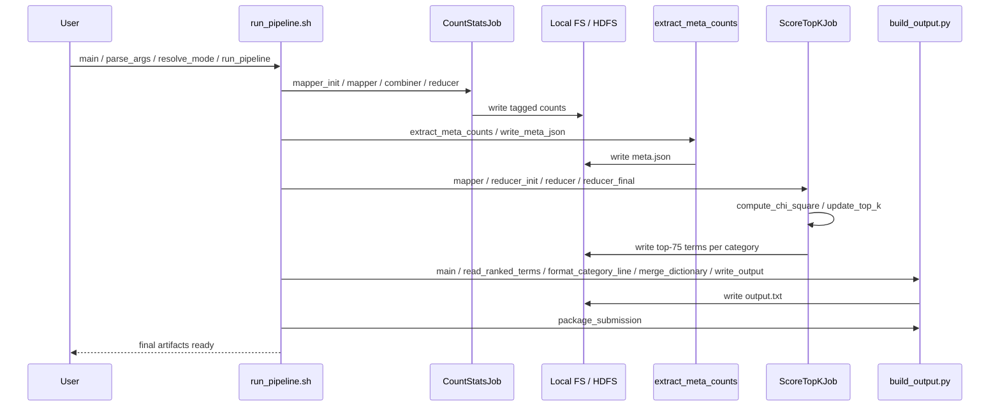
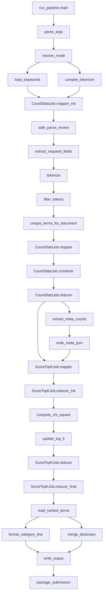

# Architecture Plan

## Context

- Target runtime is the LBD public Hadoop cluster.
- Debugging and smoke testing are done locally on the provided development split files.
- Primary quality attribute is speed on the full dataset, with low deployment risk on shared infrastructure.
- Hard constraints are mrjob, relative paths, parameterized input paths, document-per-category chi-square semantics, and output in the assignment format.

## 1. Function Blocks

| Block | Main functions | Purpose | Description | Implemented in |
| --- | --- | --- | --- | --- |
| Configuration | `TARGET_PLATFORM`, `TOP_K_TERMS`, `TOKEN_DELIMITER_PATTERN`, `DEFAULT_*` constants | Keep shared runtime values centralized | Define stable paths, tags, limits, and tokenization constants used across jobs and scripts. | `src/settings.py` |
| Orchestration | `main`, `parse_args`, `resolve_mode`, `run_pipeline`, `package_submission` | Control execution | Select local or Hadoop runner, resolve input and output paths, and execute the pipeline in the correct order. | `src/run_pipeline.sh`, `src/build_output.py` |
| Input parsing | `safe_parse_review`, `extract_required_fields` | Keep ingest cheap and safe | Read one JSON review per line, skip malformed records, and keep only `reviewText` and `category` for downstream work. | `src/common.py` |
| Text normalization | `load_stopwords`, `compile_tokenizer`, `tokenize`, `filter_tokens` | Produce canonical terms | Split text with the required delimiters, lowercase, remove stopwords, and drop single-character tokens. | `src/common.py` |
| Document feature builder | `unique_terms_for_document` | Enforce chi-square semantics | Convert tokens to a document-level unique term set so a term contributes at most once per review. | `src/common.py` |
| Count statistics job | `CountStatsJob.mapper_init`, `mapper`, `combiner`, `reducer` | Aggregate all counts in one raw-data scan | Emit tagged counts for total documents `N`, category documents `N_c`, term documents `N_t`, and term-category documents `N_tc`. | `src/job_count_stats.py` |
| Metadata extraction | `extract_meta_counts`, `write_meta_json` | Build small broadcast state | Extract `N` and all `N_c` values from the first job output into a compact JSON blob passed to the scoring job. | `src/build_output.py` |
| Score and top-k job | `compute_chi_square`, `update_top_k`, `ScoreTopKJob.mapper`, `reducer_init`, `reducer`, `reducer_final` | Compute chi-square and keep only top results | Join `N_t` with `N_tc`, compute chi-square per category, and maintain a bounded heap of top 75 terms per category. | `src/common.py`, `src/job_score_topk.py` |
| Output builder | `read_ranked_terms`, `format_category_line`, `merge_dictionary`, `write_output` | Produce final deliverable text | Sort categories alphabetically, serialize the top 75 terms per category, and emit the merged dictionary line. | `src/build_output.py` |
| Local debug harness | `run_local_debug`, `run_smoke_case` | Shorten iteration time | Run the same pipeline on the split dev files locally before any HDFS execution. | `src/run_local_debug.sh`, `src/tests/test_smoke_local.py` |

## 2. Function Call Sequence

Recommended execution order for both local debugging and cluster runs:

1. `main()`, `parse_args()`, `resolve_mode()`, and `run_pipeline()` in `run_pipeline.sh` select the runner and orchestrate the pipeline.
2. `load_stopwords()` and `compile_tokenizer()` prepare immutable preprocessing state for the counting stage.
3. `CountStatsJob.mapper_init()`, `mapper()`, `combiner()`, and `reducer()` scan raw review documents and write aggregated counts.
4. `extract_meta_counts()` and `write_meta_json()` derive and persist the `N` and `N_c` metadata needed by scoring.
5. `ScoreTopKJob.mapper()`, `reducer_init()`, `compute_chi_square()`, `update_top_k()`, `reducer()`, and `reducer_final()` compute chi-square values and keep top 75 terms per category.
6. `main()`, `read_ranked_terms()`, `format_category_line()`, `merge_dictionary()`, and `write_output()` in `build_output.py` produce `output.txt`.
7. `package_submission()` bundles output, report, source, and the run script.

### Sequence



### Dataflow



## 3. Stack used

| Layer | Choice | Why this is minimal |
| --- | --- | --- |
| Language | Python 3.x compatible with the cluster image | Matches mrjob and avoids any extra runtime dependency. |
| Distributed execution | `mrjob` | Required by the course and sufficient for local plus Hadoop execution. |
| Parsing and text processing | Python standard library: `json`, `re`, `string` | Enough for line-delimited JSON and delimiter-based tokenization. |
| Math and ranking | Python standard library: `math`, `heapq` | Enough for chi-square calculation and bounded top-k heaps. |
| CLI and paths | Python standard library: `argparse`, `pathlib`, `subprocess` | Enough for orchestration without extra tooling. |
| Testing | Python standard library: `unittest` | Enough for basic testing. |
| Shell | `bash` | Minimal wrapper for local debug and Hadoop submission commands. |

Avoid `pandas`, `numpy`, `scipy`, Spark, or any non-standard tokenizer package. They increase deployment risk and are unnecessary for this assignment.

## 4. Project Structure

```text
Task1/                                       assignment root for code, docs, and final artifacts
├── requirements/                            planning docs, requirements, probe output, and provided assets
│   ├── arch.md                              architecture plan and implementation guidance
│   ├── Checklist.md                         execution checklist for implementation and submission
│   ├── LDBvars.txt                          saved cluster probe output for verified target facts
│   ├── Requiremnts.md                       condensed assignment requirements and target notes
│   ├── Assignment_1_Instructions.pdf        authoritative assignment specification
│   ├── diagnose_cluster.sh                  target-cluster diagnostic shell probe
│   └── Assets/                              provided stopwords, dev data shards, and helper script
├── src/                                     implementation code and runnable entry points
│   ├── settings.py                          shared constants for paths, tags, limits, and defaults
│   ├── common.py                            shared parsing, tokenization, scoring, and formatting helpers
│   ├── job_count_stats.py                   first mrjob stage for N, Nc, Nt, and Ntc counts
│   ├── job_score_topk.py                    second mrjob stage for chi-square scoring and top-k selection
│   ├── build_output.py                      metadata extraction, final formatting, and packaging helpers
│   ├── run_pipeline.sh                      main local and Hadoop orchestration entry point
│   ├── run_local_debug.sh                   fast local smoke-run wrapper for dev inputs
│   └── tests/                               narrow local validation and smoke tests
│       ├── test_common.py                   tests for tokenization, filtering, and score helpers
│       ├── test_chi_square.py               tests for ranking order and top-k retention behavior
│       └── test_smoke_local.py              small end-to-end local pipeline smoke test
└── report/                                  final report location for submission packaging
    └── report.pdf                           written report artifact included in the zip deliverable
```

## 5. Speed-First Implementation Options

| Option | Summary | Raw data scans | Speed | Complexity | Risk on public cluster | Recommendation |
| --- | --- | --- | --- | --- | --- | --- |
| A. Two-job pipeline plus local output builder | Job 1 computes all counts in one raw-data pass, a tiny meta extractor builds `N` and `N_c`, Job 2 computes chi-square and top 75, local builder writes `output.txt`. | 1 | High | Medium | Low to medium | Recommended |
| B. Three-job explicit pipeline | Separate jobs for global/category stats, term and term-category counts, then scoring and ranking. | 2 | Medium | Low | Low | Good fallback if implementation clarity matters more than runtime |
| C. Monolithic multi-step mrjob pipeline | One codebase with more aggressive tagged joins and internal multi-step flow. | 1 | Potentially high | High | High | Not recommended under deadline pressure |

### Recommended Option: A

Option A is the best tradeoff for this assignment. It minimizes full-dataset scans, keeps dependencies minimal, remains debuggable locally, and avoids overly clever mrjob internals that are risky on a shared Hadoop cluster.

## 6. Architectural Decision Records

### ADR-001: Choose a two-job pipeline

- Status: Accepted
- Context: The target environment is a shared public Hadoop cluster, and speed is the primary quality attribute.
- Decision: Use one counting job over raw reviews, then one scoring job over aggregated counts, with a small local metadata extraction step between them.
- Consequences: Only one full raw-data scan is required, cluster runtime is reduced, and the design stays understandable enough for local debugging.

### ADR-002: Count document presence, not term frequency

- Status: Accepted
- Context: The assignment defines chi-square on a document-per-category basis.
- Decision: Deduplicate terms within each review before any term counts are emitted.
- Consequences: The statistics match the required semantics, and shuffle volume is reduced because repeated tokens within a review are collapsed early.

### ADR-003: Use only mrjob plus Python standard library

- Status: Accepted
- Context: Final grading runs from the submitted archive on infrastructure where extra dependencies must not be assumed.
- Decision: Restrict the implementation stack to Python, mrjob, bash, and standard library modules.
- Consequences: Packaging is simpler, deployment risk is lower, and local debugging remains close to cluster behavior.

## 7. Local Debugging Strategy

- Run the exact same two-job pipeline locally with `-r local` before any Hadoop execution.
- Use the provided split dev files as the default smoke-test input set.
- Add a very small fixture with known expected chi-square ordering to validate correctness before scale tests.
- Only switch to the full HDFS path after local correctness and one small-cluster sanity run are stable.

## 8. Textual Function Dependency Tree

```text
run_pipeline.sh
`-- main
    |-- parse_args
    |-- resolve_mode
    `-- run_pipeline
        |-- CountStatsJob.mapper_init
        |   |-- load_stopwords
        |   `-- compile_tokenizer
        |-- CountStatsJob.mapper
        |   |-- safe_parse_review
        |   |-- extract_required_fields
        |   |-- tokenize
        |   |-- filter_tokens
        |   `-- unique_terms_for_document
        |-- CountStatsJob.combiner
        |-- CountStatsJob.reducer
        |-- extract_meta_counts
        |-- write_meta_json
        |-- ScoreTopKJob.mapper
        |-- ScoreTopKJob.reducer_init
        |-- ScoreTopKJob.reducer
        |   |-- compute_chi_square
        |   `-- update_top_k
        |-- ScoreTopKJob.reducer_final
        |-- build_output.main
        |   |-- read_ranked_terms
        |   |-- format_category_line
        |   |-- merge_dictionary
        |   `-- write_output
        `-- package_submission

run_local_debug.sh
`-- main
    `-- run_local_debug
        `-- run_pipeline.sh main (local mode)

tests/test_smoke_local.py
`-- run_smoke_case
    `-- run_local_debug.sh main
```