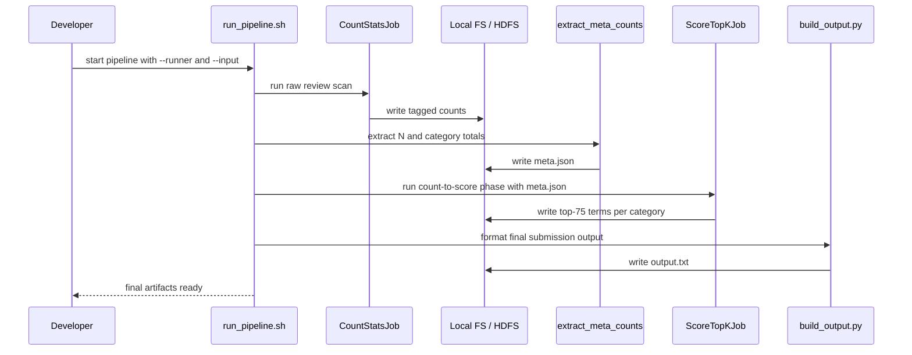

# Architecture Plan

## Context

- Target runtime is the LBD public Hadoop cluster.
- Debugging and smoke testing are done locally on the provided development split files.
- Primary quality attribute is speed on the full dataset, with low deployment risk on shared infrastructure.
- Hard constraints are mrjob, relative paths, parameterized input paths, document-per-category chi-square semantics, and output in the assignment format.

## 1. Function Blocks

| Block | Main functions | Purpose | Description | Implemented in |
| --- | --- | --- | --- | --- |
| Orchestration | `main`, `parse_args`, `resolve_mode`, `run_pipeline`, `package_submission` | Control execution | Select local or Hadoop runner, resolve input and output paths, and execute the pipeline in the correct order. | `src/run_pipeline.sh`, `src/build_output.py` |
| Input parsing | `safe_parse_review`, `extract_required_fields` | Keep ingest cheap and safe | Read one JSON review per line, skip malformed records, and keep only `reviewText` and `category` for downstream work. | `src/common.py` |
| Text normalization | `load_stopwords`, `compile_tokenizer`, `tokenize`, `filter_tokens` | Produce canonical terms | Split text with the required delimiters, lowercase, remove stopwords, and drop single-character tokens. | `src/common.py` |
| Document feature builder | `unique_terms_for_document` | Enforce chi-square semantics | Convert tokens to a document-level unique term set so a term contributes at most once per review. | `src/common.py` |
| Count statistics job | `CountStatsJob.mapper_init`, `mapper`, `combiner`, `reducer` | Aggregate all counts in one raw-data scan | Emit tagged counts for total documents `N`, category documents `N_c`, term documents `N_t`, and term-category documents `N_tc`. | `src/job_count_stats.py` |
| Metadata extraction | `extract_meta_counts`, `write_meta_json` | Build small broadcast state | Extract `N` and all `N_c` values from the first job output into a compact JSON blob passed to the scoring job. | `src/build_output.py` |
| Score and top-k job | `compute_chi_square`, `update_top_k`, `ScoreTopKJob.mapper`, `reducer_init`, `reducer`, `reducer_final` | Compute chi-square and keep only top results | Join `N_t` with `N_tc`, compute chi-square per category, and maintain a bounded heap of top 75 terms per category. | `src/common.py`, `src/job_score_topk.py` |
| Output builder | `read_ranked_terms`, `format_category_line`, `merge_dictionary`, `write_output` | Produce final deliverable text | Sort categories alphabetically, serialize the top 75 terms per category, and emit the merged dictionary line. | `src/build_output.py` |
| Local debug harness | `run_local_debug`, `run_smoke_case` | Shorten iteration time | Run the same pipeline on the split dev files locally before any HDFS execution. | `src/run_local_debug.sh`, `src/tests/test_smoke_local.py` |

## 2. Function Call Sequence

Recommended execution order for both local debugging and cluster runs:

1. `run_pipeline.main()` parses arguments and selects `local` or `hadoop` mode.
2. `load_stopwords()` and `compile_tokenizer()` prepare immutable preprocessing state.
3. `CountStatsJob.run()` scans raw review documents and writes aggregated counts.
4. `extract_meta_counts()` reads only the meta records needed for `N` and `N_c`.
5. `ScoreTopKJob.run(meta)` reads the count output, computes chi-square, and keeps top 75 terms per category.
6. `build_output.main()` formats category lines and the merged dictionary into `output.txt`.
7. `package_submission()` bundles output, report, source, and the run script.

### Mermaid Sequence



## 3. Minimal Stack

| Layer | Choice | Why this is minimal |
| --- | --- | --- |
| Language | Python 3.x compatible with the cluster image | Matches mrjob and avoids any extra runtime dependency. |
| Distributed execution | `mrjob` | Required by the course and sufficient for local plus Hadoop execution. |
| Parsing and text processing | Python standard library: `json`, `re`, `string` | Enough for line-delimited JSON and delimiter-based tokenization. |
| Math and ranking | Python standard library: `math`, `heapq` | Enough for chi-square calculation and bounded top-k heaps. |
| CLI and paths | Python standard library: `argparse`, `pathlib`, `subprocess` | Enough for orchestration without extra tooling. |
| Testing | Python standard library: `unittest` | Avoids adding `pytest` unless the team already prefers it. |
| Shell | `bash` | Minimal wrapper for local debug and Hadoop submission commands. |

Avoid `pandas`, `numpy`, `scipy`, Spark, or any non-standard tokenizer package. They increase deployment risk and are unnecessary for this assignment.

## 4. Suggested Project Structure

```text
Task1/
├── requirements/
│   ├── arch.md
│   ├── Checklist.md
│   ├── Requiremnts.md
│   ├── Assignment_1_Instructions.pdf
│   └── Assets/
├── src/
│   ├── common.py
│   ├── job_count_stats.py
│   ├── job_score_topk.py
│   ├── build_output.py
│   ├── run_pipeline.sh
│   ├── run_local_debug.sh
│   └── tests/
│       ├── test_common.py
│       ├── test_chi_square.py
│       └── test_smoke_local.py
└── report/
    └── report.pdf
```

| Path | Purpose |
| --- | --- |
| `requirements/arch.md` | Architecture planning note and implementation guidance. |
| `requirements/Checklist.md` | Execution checklist for implementation and submission. |
| `requirements/Requiremnts.md` | Condensed assignment requirements captured from the PDF. |
| `requirements/Assets/` | Provided local dev data shards, stopwords, and helper script. |
| `src/common.py` | Shared tokenizer, stopword loader, chi-square function, record tags, and formatting helpers. |
| `src/job_count_stats.py` | First mrjob job that emits and aggregates `N`, `N_c`, `N_t`, and `N_tc`. |
| `src/job_score_topk.py` | Second mrjob job that joins counts, computes chi-square, and keeps the top 75 per category. |
| `src/build_output.py` | Final formatter for category lines and the merged alphabetical dictionary. |
| `src/run_pipeline.sh` | Main entry point for local and Hadoop execution. |
| `src/run_local_debug.sh` | Fast local smoke-run wrapper against the split dev files. |
| `src/tests/test_common.py` | Unit tests for tokenization, stopword filtering, and chi-square math. |
| `src/tests/test_chi_square.py` | Focused tests for score correctness and ordering behavior. |
| `src/tests/test_smoke_local.py` | Small end-to-end local pipeline smoke test. |
| `report/report.pdf` | Final written report artifact for submission packaging. |

## 5. Speed-First Implementation Options

| Option | Summary | Raw data scans | Speed | Complexity | Risk on public cluster | Recommendation |
| --- | --- | --- | --- | --- | --- | --- |
| A. Two-job pipeline plus local output builder | Job 1 computes all counts in one raw-data pass, a tiny meta extractor builds `N` and `N_c`, Job 2 computes chi-square and top 75, local builder writes `output.txt`. | 1 | High | Medium | Low to medium | Recommended |
| B. Three-job explicit pipeline | Separate jobs for global/category stats, term and term-category counts, then scoring and ranking. | 2 | Medium | Low | Low | Good fallback if implementation clarity matters more than runtime |
| C. Monolithic multi-step mrjob pipeline | One codebase with more aggressive tagged joins and internal multi-step flow. | 1 | Potentially high | High | High | Not recommended under deadline pressure |

### Recommended Option: A

Option A is the best tradeoff for this assignment. It minimizes full-dataset scans, keeps dependencies minimal, remains debuggable locally, and avoids overly clever mrjob internals that are risky on a shared Hadoop cluster.

## 6. Architectural Decision Records

### ADR-001: Choose a two-job pipeline

- Status: Accepted
- Context: The target environment is a shared public Hadoop cluster, and speed is the primary quality attribute.
- Decision: Use one counting job over raw reviews, then one scoring job over aggregated counts, with a small local metadata extraction step between them.
- Consequences: Only one full raw-data scan is required, cluster runtime is reduced, and the design stays understandable enough for local debugging.

### ADR-002: Count document presence, not term frequency

- Status: Accepted
- Context: The assignment defines chi-square on a document-per-category basis.
- Decision: Deduplicate terms within each review before any term counts are emitted.
- Consequences: The statistics match the required semantics, and shuffle volume is reduced because repeated tokens within a review are collapsed early.

### ADR-003: Use only mrjob plus Python standard library

- Status: Accepted
- Context: Final grading runs from the submitted archive on infrastructure where extra dependencies must not be assumed.
- Decision: Restrict the implementation stack to Python, mrjob, bash, and standard library modules.
- Consequences: Packaging is simpler, deployment risk is lower, and local debugging remains close to cluster behavior.

## 7. Local Debugging Strategy

- Run the exact same two-job pipeline locally with `-r local` before any Hadoop execution.
- Use the provided split dev files as the default smoke-test input set.
- Add a very small fixture with known expected chi-square ordering to validate correctness before scale tests.
- Only switch to the full HDFS path after local correctness and one small-cluster sanity run are stable.