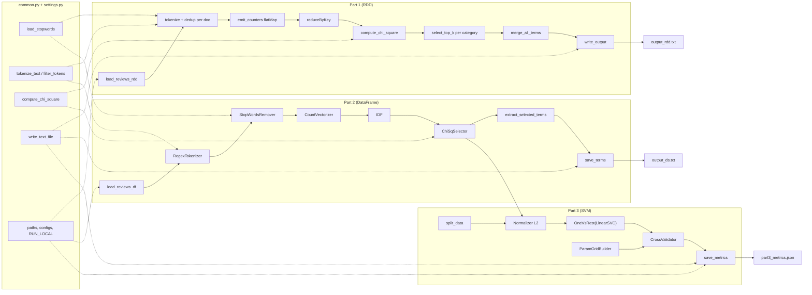
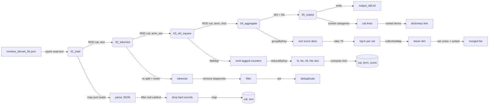

## task 2 requirements here

---

# Assignment 2 formal requirements

## Core information
- **Group work**: Same group as Assignment 1
- **Platform**: LBD Hadoop Cluster (lbd.tuwien.ac.at) with Spark
- **Dataset**: Amazon Review Dataset 2014 (same as Task 1)

## Dataset paths
- **Development set**: `hdfs:///dic_shared/amazon-reviews/full/reviews_devset.json`
- **Full dataset** (optional): `hdfs:///dic_shared/amazon-reviews/full/reviewscombined.json`
- **Local copy**: Available in Task1/requirements/Assets for development
- **Use development set for all submissions and comparisons**

## Environment details (from LDBvars.txt)
- **User**: e12533692
- **Home**: /home/e12533692
- **Host**: jupyter-e12533692
- **OS**: Ubuntu 24.04.3 LTS (Noble Numbat)
- **Kernel**: Linux 5.14.0-611.26.1.el9_7.x86_64
- **Memory**: 61GB total, 49GB available
- **CPUs**: 16 cores
- **Shell**: bash 5.2.21

## Dependencies on Task 1
- Reuses Amazon Review Dataset
- Builds on chi-square feature selection concept
- Compares outputs with Task 1 results (output.txt)
- Same preprocessing rules: tokenization, casefolding, stopword filtering
- Same stopwords.txt file from Task 1

## Part 1: RDDs
### Requirements
- Reimplement Task 1 chi-square calculation using Spark RDDs and transformations
- Calculate chi-square values for all unigram terms per category
- Sort and output top 75 terms per category (descending by chi-square)
- Generate merged dictionary (all terms, alphabetically sorted)
- Output format: identical to Task 1
  - One line per category: `<category> term_1:chi^2 term_2:chi^2 ... term_75:chi^2`
  - One line with merged dictionary (space-separated, alphabetical)

### Deliverables
- **output_rdd.txt**: Generated output from RDD implementation
- **Comparison**: Compare output_rdd.txt with Task 1 output.txt
- **Report section**: Describe observations from comparison

### Key constraints
- Use RDD API only (no DataFrames in this part)
- Apply same preprocessing as Task 1
- Maintain efficiency (runtime considerations apply)

## Part 2: DataFrames/Datasets with Spark ML
### Requirements
- Convert review texts to TF-IDF weighted vector space representation
- Use DataFrame/Dataset API exclusively
- Build transformation pipeline for Part 3
- Select 2000 top terms overall using chi-square

### Pipeline components (use built-in Spark functions)
1. **Tokenization**: whitespaces, tabs, digits, delimiters `()[]{}.!?,;:+=-_"'~#@&*%€$§\/`
2. **Casefolding**: lowercase conversion
3. **Stopword removal**: Use stopwords.txt from Task 1, filter 1-character tokens
4. **TF-IDF calculation**: Term frequency-inverse document frequency
5. **Chi-square selection**: Select 2000 top terms overall

### Deliverables
- **output_ds.txt**: Terms selected by chi-square (2000 terms)
- **Comparison**: Compare with Task 1 term selection
- **Report section**: Describe observations

### Key constraints
- Use Spark ML built-in functions only
- Results may differ from Task 1 (expected, document why)
- Pipeline must be reusable for Part 3

## Part 3: Text classification
### Requirements
- Train multi-class text classifier to predict product category from review text
- Extend Part 2 pipeline with SVM classifier
- Use binary classification strategy for multi-class problem
- Apply L2 vector normalization before classification

### ML experiment design
1. **Data split**: training, validation, test sets
2. **Reproducibility**: Make experiments reproducible
3. **Grid search**: Parameter optimization using Spark functions

### Grid search parameters
- **Chi-square features**: 
  - 2000 terms (from Part 2)
  - Heavier filtering with much less dimensionality (see Spark ML docs)
- **SVM regularization**: 3 different values
- **Standardization**: 2 values (on/off)
- **Max iterations**: 2 values
- **Total combinations**: 2 × 3 × 2 × 2 = 24 configurations

### Evaluation
- Use `MulticlassClassificationEvaluator`
- Metric: F1 measure
- Evaluate on test set
- Report performance indicators for all settings

### Deliverables
- Trained classifier pipeline
- Grid search results table
- Performance comparison
- Result interpretation in report

### Key constraints
- Use development set for training/testing (may downsample for initial runs)
- Final evaluation on full development set (no downsampling)
- Stop Spark contexts after completion
- Shutdown kernels when done

## Code documentation
- Document all code, intermediate outputs, graphs
- Make choices traceable
- If using Spark jobs: very detailed documentation required
- Show data flow and transformations

## Report requirements
### Structure (max 8 pages A4, 11pt font, one column)
1. **Introduction**
2. **Problem overview**
3. **Methodology and approach**
   - Pipeline figure (max 1 page)
   - Illustrate strategy and data flow
4. **Results**
   - Performance indicators over different settings
   - Result interpretation
5. **Conclusions**

### Additional requirements
- List contributing group members at beginning
- Inactive members should not be listed (receive 0 points)
- If no names listed, all members considered contributing

## Submission files
Package as `<groupID>_DIC2026_Assignment_2.zip`:
```
output_rdd.txt           # Part 1 results
output_ds.txt            # Part 2 results
report.pdf               # Max 8 pages
src/                     # Source directory
  ├── notebook.ipynb     # Jupyter notebook(s) - preferred
  └── *.py               # Or documented Spark jobs
```

## Efficiency considerations
- Implementation efficiency crucial for scoring
- Avoid unnecessary overheads and calculations
- Test with small data samples first
- Do not probe data with non-Spark packages
- Monitor resource usage, kill jobs if needed
- Cluster has 48-hour kernel time limit (extended from 2 hours)
- Always stop Spark contexts after finishing
- Always shutdown kernels when not in use
- Plan ahead, avoid last-minute cluster congestion

## Execution modes
### Local development
1. Jupyter notebooks with local dataset files
2. Load reviews_devset parts from Task1/requirements/Assets
3. Develop and test locally first

### Cluster execution options
1. **JupyterHub environment** (interactive)
   - Best for development and testing
   - 48-hour kernel time limit
   - Stop kernels when done
   - Cannot directly access HDFS in notebook kernel

2. **spark-submit (local mode)**
   - Convert notebook: `jupyter nbconvert --to script script.ipynb`
   - Run: `spark-submit script.py`
   - Can use HDFS paths
   - Outputs to local filesystem/terminal

3. **spark-submit (distributed mode)**
   - Run: `spark-submit --master yarn --deploy-mode cluster script.py`
   - Can use HDFS paths
   - View logs: `yarn logs -applicationId <application_id>`
   - Write outputs to HDFS: `hdfs:///user/<username>/output`

4. **Interactive shells**
   - `pyspark` (Python)
   - `spark-shell` (Scala)

See `~/dataLAB/demos/pyspark_local_vs_yarn.ipynb` on cluster for examples.

## Scoring breakdown
| Component | Points |
|-----------|--------|
| Part 1 (RDDs) | 30 |
| Part 2 (DataFrames) | 25 |
| Part 3 (Classification) | 25 |
| Code documentation | 10 |
| Report | 10 |
| **Total** | **100** |

---

# Suggested technology stack

## Core requirements
- **Python**: 3.12.x (cluster version)
- **Apache Spark**: 3.x (cluster-provided)
- **PySpark**: Core API for all parts
- **Spark ML**: Built-in machine learning library
- **HDFS client**: Cluster-provided for data access
- **Jupyter**: Notebook environment (preferred)

## Python libraries (minimal dependencies)

### Required (cluster-provided)
```
pyspark              # Core Spark API
```

### Spark ML components (built-in, no install needed)
```python
# Part 1: RDD operations
from pyspark import SparkContext, SparkConf
from pyspark.rdd import RDD

# Part 2: DataFrame/Dataset operations
from pyspark.sql import SparkSession, DataFrame
from pyspark.sql.functions import *
from pyspark.ml.feature import (
    Tokenizer,              # Or RegexTokenizer
    StopWordsRemover,
    HashingTF,             # Or CountVectorizer
    IDF,
    ChiSqSelector,
    Normalizer
)
from pyspark.ml import Pipeline

# Part 3: Classification
from pyspark.ml.classification import LinearSVC, OneVsRest
from pyspark.ml.evaluation import MulticlassClassificationEvaluator
from pyspark.ml.tuning import ParamGridBuilder, CrossValidator
```

### Optional (for development only)
```
jupyter              # Already on cluster
papermill            # If converting notebooks to scripts with outputs
```

## Project structure
```
Task2/
├── data/                             # local dev set + stopwords (gitignored)
├── materials/                        # assignment PDF, demo notebook, this log
├── src/                              # 25 .py modules, 4 shell scripts
├── output/                           # output_rdd.txt, output_ds.txt, part3_metrics.json
└── presentation/                     # presentation.md (report draft)
```
See the detailed tree in the Development log section below.

## Implementation strategy

### Phase 1: Setup and data loading
1. Create SparkSession with appropriate configuration
2. Load development dataset (local or HDFS)
3. Parse JSON reviews into DataFrame/RDD
4. Load stopwords from Task1/requirements/Assets/stopwords.txt

### Phase 2: Part 1 (RDD approach)
1. Extract (category, reviewText) pairs
2. Tokenize using string operations
3. Apply stopword filtering
4. Calculate document-term presence matrix
5. Compute chi-square statistics per category
6. Sort and select top 75 terms per category
7. Merge and sort all unique terms
8. Format output matching Task 1

### Phase 3: Part 2 (DataFrame approach)
1. Build Spark ML pipeline:
   - RegexTokenizer → StopWordsRemover → CountVectorizer → IDF → ChiSqSelector
2. Fit pipeline on dataset
3. Extract selected 2000 terms
4. Save pipeline for Part 3

### Phase 4: Part 3 (Classification)
1. Extend Part 2 pipeline with Normalizer
2. Add LinearSVC with OneVsRest for multi-class
3. Split data: train/validation/test
4. Configure ParamGridBuilder with specified parameters
5. Run CrossValidator or TrainValidationSplit
6. Evaluate best model on test set
7. Record F1 scores for all configurations

### Phase 5: Comparison and reporting
1. Compare output_rdd.txt vs output.txt (Task 1)
2. Compare output_ds.txt vs Task 1 terms
3. Analyze performance metrics
4. Create pipeline visualization
5. Write report sections

## Configuration recommendations

### Spark session configuration
```python
spark = SparkSession.builder \
    .appName("Task2-Assignment2") \
    .config("spark.driver.memory", "4g") \
    .config("spark.executor.memory", "4g") \
    .config("spark.sql.shuffle.partitions", "200") \
    .getOrCreate()
```

### Local development paths
```python
LOCAL_DEVSET = "../Task1/requirements/Assets/reviews_devset.part_*.json"
LOCAL_STOPWORDS = "../Task1/requirements/Assets/stopwords.txt"
```

### HDFS paths (for cluster submission)
```python
HDFS_DEVSET = "hdfs:///dic_shared/amazon-reviews/full/reviews_devset.json"
HDFS_FULL = "hdfs:///dic_shared/amazon-reviews/full/reviewscombined.json"
```

### Chi-square selector settings
```python
# Part 2: Select top 2000 terms overall
chi_selector = ChiSqSelector(
    numTopFeatures=2000,
    featuresCol="tfidf_features",
    outputCol="selected_features",
    labelCol="category_index"
)

# Part 3: Grid search with heavier filtering
chi_params = [2000, 500]  # or [2000, 1000], etc.
```

### SVM grid search parameters
```python
from pyspark.ml.tuning import ParamGridBuilder

param_grid = ParamGridBuilder() \
    .addGrid(chi_selector.numTopFeatures, [2000, 500]) \
    .addGrid(svm.regParam, [0.01, 0.1, 1.0]) \
    .addGrid(svm.standardization, [True, False]) \
    .addGrid(svm.maxIter, [50, 100]) \
    .build()
```

## Best practices
1. **Start small**: Test on subset of development set first
2. **Cache strategically**: Cache RDDs/DataFrames used multiple times
3. **Monitor resources**: Check Spark UI for job progress
4. **Fail fast**: Set reasonable timeouts
5. **Clean up**: Always call `spark.stop()` at end
6. **Version control**: Track notebook versions locally
7. **Document inline**: Add comments explaining each step
8. **Reproducibility**: Set random seeds for train/test splits

## Risk mitigation
- **Cluster downtime**: Develop locally with sample data first
- **Kernel timeouts**: Break work into smaller execution blocks
- **Memory issues**: Reduce data sample size for initial testing
- **HDFS access**: Test HDFS paths with small reads first

## Notes
- Spark ML may produce different results than Task 1 mrjob implementation
- Document and explain any differences in report
- Focus on correctness, efficiency, and clear documentation

---

# Project structure

```
Task2/
├── .gitignore
│
├── data/
│   ├── readme.md                # Local dev data location
│   ├── extract_sample.sh        # Pull 5k records from HDFS for local dev
│   ├── reviews_devset_5k.json   # 5000-record local dev sample (gitignored)
│   └── stopwords.txt            # Local copy (gitignored)
│
├── materials/
│   ├── Assignment_2_Instructions.pdf
│   ├── pyspark_local_vs_yarn.ipynb  # LBD cluster demo (from ~/dataLAB/demos)
│   └── req.md
│
├── src/
│   ├── settings.py              # Paths, constants, Spark configs, LOCAL_SPARK_RAM
│   ├── common.py                # _load_text_rdd, load_stopwords, tokenize, chi-square, write_text_file
│   ├── requirements.txt         # pyspark==4.1.1
│   ├── readme.md
│   │
│   ├── part1_01_load.py         # Load JSON as RDD of (category, reviewText)
│   ├── part1_02_tokenize.py     # Tokenization + stopword filter + dedup per doc
│   ├── part1_03_chi_square.py   # Chi-square via single reduceByKey pass + sentinel counters
│   ├── part1_04_aggregate.py    # Top-k selection per category + alphabetical merge
│   ├── part1_05_output.py       # Format output via write_text_file (local or HDFS)
│   ├── part1_06_runner.py       # Part 1 orchestrator
│   │
│   ├── part2_01_load.py         # Re-export load_reviews_df from common
│   ├── part2_02_tokenizer.py    # RegexTokenizer with Task 1 delimiter pattern
│   ├── part2_03_stopwords.py    # StopWordsRemover + 1-char filter (a-z added)
│   ├── part2_04_vectorizer.py   # CountVectorizer (no vocab cap)
│   ├── part2_05_idf.py          # IDF estimator
│   ├── part2_06_chi_selector.py # ChiSqSelector (2000 top features)
│   ├── part2_07_pipeline.py     # StringIndexer + 5-stage pipeline, fit
│   ├── part2_08_output.py       # Extract vocab from fitted model, save output_ds.txt
│   ├── part2_09_runner.py       # Part 2 orchestrator
│   │
│   ├── part3_01_data_split.py   # randomSplit (70/15/15, seed=42)
│   ├── part3_02_normalizer.py   # L2 vector normalizer
│   ├── part3_03_svm_estimator.py# LinearSVC wrapped in OneVsRest
│   ├── part3_04_pipeline.py     # Full pipeline: Part 2 + Normalizer + OneVsRest
│   ├── part3_05_grid_builder.py # 24-config ParamGrid (chi-sq x regParam x std x maxIter)
│   ├── part3_06_cross_validator.py# 2-fold CrossValidator, parallelism=2
│   ├── part3_07_evaluator.py    # MulticlassClassificationEvaluator (F1)
│   ├── part3_08_output.py       # Save metrics to JSON via write_text_file
│   ├── part3_09_runner.py       # Part 3 orchestrator
│   │
│   ├── run_part1.sh             # Shell wrapper: venv auto-detect, PYSPARK_PYTHON local-only
│   ├── run_part2.sh             # Shell wrapper for part 2
│   ├── run_part3.sh             # Shell wrapper for part 3
│   └── run_all.sh               # Calls run_part1 -> run_part2 -> run_part3 sequentially
│
├── output/
│   ├── .gitkeep
│   ├── output_rdd.txt           # Part 1 results (generated)
│   ├── output_ds.txt            # Part 2 results (generated)
│   └── part3_metrics.json       # Part 3 grid search results (generated)
│
└── presentation/
    └── presentation.md          # Report draft
```
```
- Use development set for all deliverables (avoid full dataset to reduce cluster load)

## Global pipeline -- component reuse across parts



Dashed lines show reused components. `common.py` provides tokenization, stopwords,
chi-square formula, file loading, and HDFS-aware output writing. `settings.py`
provides paths and Spark configuration. Parts 2 and 3 share the full Spark ML
pipeline up to ChiSqSelector. Part 3 extends it with classification stages.

---

# Development log

## 2026-05-13: Project initialization

### Structure created
- 27 Python modules organized by functional Spark blocks
- Part 1: RDD operations (6 modules)
- Part 2: DataFrame/Pipeline transformers and estimators (8 modules)
- Part 3: Classification with grid search (9 modules)
- Core: settings.py, common.py, run_all.py

### Settings configuration
Updated `settings.py` with runtime environment switching:
- **RUN_LOCAL** env var: Toggle between local and cluster execution
- **Local mode**: Uses merged devset from data/, 4GB memory, local[*] master
- **Cluster mode**: Uses HDFS paths, 8GB memory, YARN master with 4 executors
- Separate Spark configs for each environment
- Path resolution via pathlib for cross-platform compatibility
- Debug flag via DEBUG env var

### Dependencies
Created `requirements.txt` with minimal dependency:
- **pyspark==4.1.1** - Only external dependency required
- All other functionality uses Python stdlib (os, pathlib, json, re)
- Cluster already provides PySpark, requirements.txt for local development only

### Runner architecture
**Why runners are .py not .sh:**
- Python runners can import modules, manage SparkSession lifecycle
- Direct Spark configuration and orchestration in Python
- Executable via `python part1_runner.py` locally or `spark-submit part1_runner.py` on cluster
- Shell scripts would add unnecessary indirection layer
- Python runners maintain type safety and can use shared utilities

### Runtime usage
```bash
# Local execution
RUN_LOCAL=true python src/part1_runner.py

# Cluster execution
RUN_LOCAL=false spark-submit src/part1_runner.py

# Or via run_all
python src/run_all.py
```

### Shell wrappers
Created executable shell scripts for clean invocation:
- `run_part1.sh`, `run_part2.sh`, `run_part3.sh` - Individual part runners
- `run_all.sh` - Master orchestrator

**Features:**
- Auto-detect RUN_LOCAL env var (defaults to true)
- Local mode: calls `python part*_runner.py`
- Cluster mode: calls `spark-submit part*_runner.py`
- Pass through all arguments: `./run_part1.sh --arg value`
- Set exec permissions via `chmod +x`

**Usage:**
```bash
# Local execution (default)
./src/run_part1.sh

# Cluster execution
RUN_LOCAL=false ./src/run_part1.sh

# Run all parts
./src/run_all.sh

# With output redirection
./src/run_part1.sh > logs/part1.log 2>&1
```

**Packaging-ready:** Common pattern for distributable Python projects - abstracts runtime details from users.

## 2026-05-16: Path audit and cleanup

### .vscode visibility
- `.vscode/settings.json` had `"**/.venv": true` in `files.exclude`, hiding venv in explorer.
- Removed the exclusion; `.venv` now visible in VSCode file tree.

### Python version
- Old `.venv` was Python 3.14.4 -- mismatched with target 3.12.x.
- Recreated with `/usr/local/bin/python3.12` (3.12.13).
- Reinstalled `pyspark==4.1.1` and `PyPDF2` for PDF extraction.

### Path simplification
- No `[]` characters exist in any file or directory path (confirmed via `find`).
- The `RUN_LOCAL` branch in `part1_01_load.py` and `common.py` `load_reviews_df`
  exists because macOS lacks Hadoop native libraries -- Spark's `textFile`/`read.json`
  fail with `viewfs` FileSystem provider errors on macOS. The `parallelize(lines)`
  approach bypasses Hadoop entirely for local development.
- Updated comments in both loaders to reflect the actual reason (was incorrectly
  attributed to `[]` in paths breaking Hadoop GlobFilter).

### Shell scripts location
- `run_all.sh`, `run_part1.sh`, `run_part2.sh`, `run_part3.sh` live in `src/`,
  not at `Task2/` root. They `cd "$(dirname "$0")"` so relative references work.
  The project structure diagram in this file was updated to reflect actual layout.

### Common utilities (current)
`common.py` provides:
- `load_stopwords()` -- load stopword set from file
- `_load_text_rdd()` -- single point for RUN_LOCAL file-loading workaround (macOS Hadoop compat)
- `create_spark_session()` -- environment-aware SparkSession via settings.SPARK_CONFIG
- `load_reviews_df()` -- DataFrame loader delegating to `_load_text_rdd`
- `tokenize_text()` / `filter_tokens()` -- Task 1-compatible tokenization
- `compute_chi_square()` -- chi-square on 2x2 document-presence contingency table
- `FIELD_REVIEW_TEXT`, `FIELD_CATEGORY` -- field name constants

Dead code removed 2026-05-16: `safe_parse_review`, `extract_category_text`, 6 unused `FIELD_*` constants.

### PySpark 4.1.1 Python version mismatch (2026-05-16)
- PySpark 4.1.1 bundles Python 3.14 workers inside its zip, but driver is 3.12.
- Without `PYSPARK_PYTHON` set, workers fail with `PYTHON_VERSION_MISMATCH`.
- All `run_*.sh` scripts now auto-detect the venv Python and export `PYSPARK_PYTHON`
  and `PYSPARK_DRIVER_PYTHON` to force workers to use the same 3.12 interpreter.
- On the LBD cluster (Ubuntu 24.04, Python 3.12), this should not be needed --
  the cluster PySpark is built against the system Python. The workaround is for
  local macOS development with pip-installed pyspark.

### Part 1 status (2026-05-16)
- Full RDD pipeline runs successfully on local 5k devset sample.
- Output: 25,990 scored (cat, term, chi2) pairs, 3 categories, 174 merged terms.
- `output_rdd.txt` matches Task 1 format: one alphabetical category line with top 75
  `term:score` entries per category, plus one merged alphabetical dictionary line.

## 2026-05-17: Part 2 + 3 implementation and cluster deployment

### Part 2 status
- DataFrame pipeline: StringIndexer -> RegexTokenizer -> StopWordsRemover ->
  CountVectorizer -> IDF -> ChiSqSelector (2000 top terms).
- Output: `output_ds.txt`, 2000 terms ordered by chi-square score.

### Part 3 status
- Full pipeline extends Part 2 with L2 Normalizer + OneVsRest(LinearSVC).
- 24-config grid search: 2 chi-sq features x 3 regParam x 2 standardization x 2 maxIter.
- 2-fold CrossValidator with parallelism=1 to avoid macOS multiprocessing pool bug.
- Best val F1: 0.8691 (2000 features, regParam=0.1, standardization=True, maxIter=50).
- Test F1: 0.8696 -- no overfitting.
- Output: `part3_metrics.json`, 24 entries with param configs and F1 scores.

### Cluster deployment -- problems and fixes

**Problem 1 -- YARN container memory cap**
Cluster max: 8192 MB per container. Original config: 8g executor + ~819 MB overhead
= 9011 MB, rejected. Fix: 7g executor, 2 instances.

**Problem 2 -- Client-mode driver unreachable**
YARN nodes (10.11.x network) cannot reach pod IP (10.42.x internal container
network). Fix: `--deploy-mode cluster` so driver runs on a YARN node, not the pod.

**Problem 3 -- Missing module imports on YARN driver**
`spark-submit` only uploads the main script. Fix: `--py-files` with all `src/*.py`
files so imports resolve on the YARN node.

**Problem 4 -- stopwords.txt not on YARN nodes**
Fix: `--files` ships `../data/stopwords.txt` to the driver container.
`STOPWORDS_PATH` set to `"stopwords.txt"` in cluster mode (resolves to shipped file).

**Problem 5 -- RUN_LOCAL env not propagating to YARN container**
Fix: `--conf spark.yarn.appMasterEnv.RUN_LOCAL="$RUN_LOCAL"` so settings.py
detects cluster mode.

**Problem 6 -- sc.addPyFile() breaks in cluster mode**
`addPyFile` references local paths that don't exist on the YARN container.
Redundant since `--py-files` puts all modules on PYTHONPATH. Removed.

**Problem 7 -- Output files inaccessible in cluster mode**
Driver runs on YARN node; local `open()` writes to that node's filesystem.
Fix: `write_text_file()` helper detects `/user/` paths and uses Spark's
`saveAsTextFile` to write to HDFS. Retrieve with `hdfs dfs -getmerge`.

### Shell scripts (current state)
- Auto-detect venv Python (macOS); fall back to system python3 (cluster).
- `PYSPARK_PYTHON` only exported for local mode (macOS 3.12/3.14 mismatch).
  Cluster uses system Python 3.12 matching Spark's bundled version.
- `LOCAL_SPARK_RAM` env var (default 8g) controls local driver/executor memory.
- Cluster branch: `spark-submit --master yarn --deploy-mode cluster` with
  `--py-files`, `--files`, and `--conf spark.yarn.appMasterEnv.RUN_LOCAL`.
- `run_all.sh` calls part1 -> part2 -> part3 sequentially.

### Stale code removed (2026-05-17)
- `run_all.py` -- replaced by shell script calls.
- `OUTPUT_COMPARISON` constant -- never referenced.
- `DEBUG` flag -- never checked.
- `numpy`, `PyPDF2` from requirements.txt -- not imported at runtime.
- `safe_parse_review`, `extract_category_text`, 6 unused `FIELD_*` constants.
- `sc.addPyFile()` block in part1 runner.
scp e12533692@lbd.tuwien.ac.at:~/Task2/data/stopwords.txt .
```

**Why 5000 records:**
- Full devset is ~14k records (0.1% sample of 14M)
- 5k provides sufficient variety for local testing
- Fast iteration during development
- Keeps git repo size manageable

### Data extraction fixes (2026-05-13)
Fixed `data/extract_sample.sh` path resolution:

- Uses `SCRIPT_DIR` (script location) to resolve all paths absolutely
- Derives repo root from script location: `SCRIPT_DIR/../..`
- Tries 3 stopwords sources in order:
  1. `$REPO_ROOT/Task1/requirements/Assets/stopwords.txt` (git repo)
  2. `$SCRIPT_DIR/stopwords.txt` (already downloaded)
  3. `/dic_shared/assets/stopwords.txt` (HDFS mirror, if cluster provides it)
- Outputs to `$SCRIPT_DIR/reviews_devset_5k.json`
- Added tarball packaging hint for scp download

Updated `settings.py`:
- `LOCAL_DEVSET` checks for `data/reviews_devset_5k.json` first (extracted sample), falls back to Task1 dev parts
- `LOCAL_STOPWORDS` checks `data/stopwords.txt` first, falls back to Task1 assets

Updated `.gitignore`:
- Excludes extracted data files: `reviews_devset_5k.json`, `stopwords.txt`, `task2_dev_data.tar.gz`

### Schema verification (2026-05-14)
Verified DataFrame column mapping against sample data:

- 5000 rows, 0 nulls on reviewText and category
- FIELD_REVIEW_TEXT = "reviewText" matches schema
- FIELD_CATEGORY = "category" matches schema
- Spark 4.1.1 + Java 21 required for local dev (Java 25 incompatible with Hadoop viewfs)

Path fix in common.py:
- `load_reviews_df()` reads locally via Python `open()` then `parallelize()` to avoid Hadoop GlobFilter issues with `[]` in workspace paths.
- On cluster HDFS paths are passed directly to `spark.read.json()`.


---

# Part 1 implementation

## Execution sequence

```
Step 01: part1_01_load      -> 02 -> 03 -> 04 -> 05
         part1_02_tokenize       |    |    |    |
         part1_03_chi_square ----+    |    |    |
         part1_04_aggregate ----------+    |    |
         part1_05_output -----------------+    |
         part1_06_runner ---------------------+
```

## Step IO (YAML)

```yaml
01_load:
  input:  JSON lines file (reviews_devset_5k.json or HDFS path)
  output: RDD[(category: str, reviewText: str)]
  drops:  records missing category or reviewText field

02_tokenize:
  input:  RDD[(category: str, reviewText: str)]
  output: RDD[(category: str, terms: set[str])]
  logic:  regex split + lowercase + stopword removal + deduplication

03_chi_square:
  input:  RDD[(category: str, terms: set[str])]
  output: RDD[(category: str, term: str, chi2_score: float)]
  logic:  flatMap tagged counters -> reduceByKey -> chi-square on driver

04_aggregate:
  input:  RDD[(category: str, term: str, chi2_score: float)]
  output: dict[category: list[(term, score)]] + list[str]
  logic:  groupByKey -> top-75 by score desc, term asc -> merge alphabetically

05_output:
  input:  dict + merged list
  output: output_rdd.txt (3 category lines + 1 merged dictionary line)

06_runner:
  input:  settings (paths, params)
  output: orchestrates steps 01-05, prints progress
  guard:  try/finally with spark.stop() in finally block
```

## Purpose of each step

**01_load**
Read the JSON review dataset (local or HDFS) and extract only the two fields needed
for chi-square feature selection. Drops malformed lines and records missing
category or reviewText to keep the pipeline compact.

**02_tokenize**
Convert free-text reviews into sets of lowercase unigrams. Uses the same regex
delimiter pattern as Task 1 for consistent results. Deduplicates terms per
document (document-presence semantics) before stopword filtering. This is the
only point that loads the stopword list -- it broadcasts naturally through the
RDD closure.

**03_chi_square**
Collects all contingency-table counters in one flatMap/reduceByKey pass:
total docs (N), docs per category (Nc), docs per term (Nt), and docs per
(category, term) pair (Ntc). After aggregation the driver computes chi-square
for every pair. Sentinel prefixed keys (__N__, __NC__, __NT__) keep
everything in one key space so a single reduceByKey accumulates all counters.
The sentinel pairs are filtered out before scoring.

**04_aggregate**
Groups scored pairs by category and selects the top 75 terms per category.
Sort order: chi-square score descending, then term alphabetically for ties.
Collects all unique terms across categories into a merged alphabetical list
for the dictionary line.

**05_output**
Writes output_rdd.txt in the exact format from Task 1: one line per category
(sorted alphabetically), each with 75 term:score pairs in descending order,
followed by one line containing all terms space-separated and alphabetically
sorted.

## Mermaid diagram


