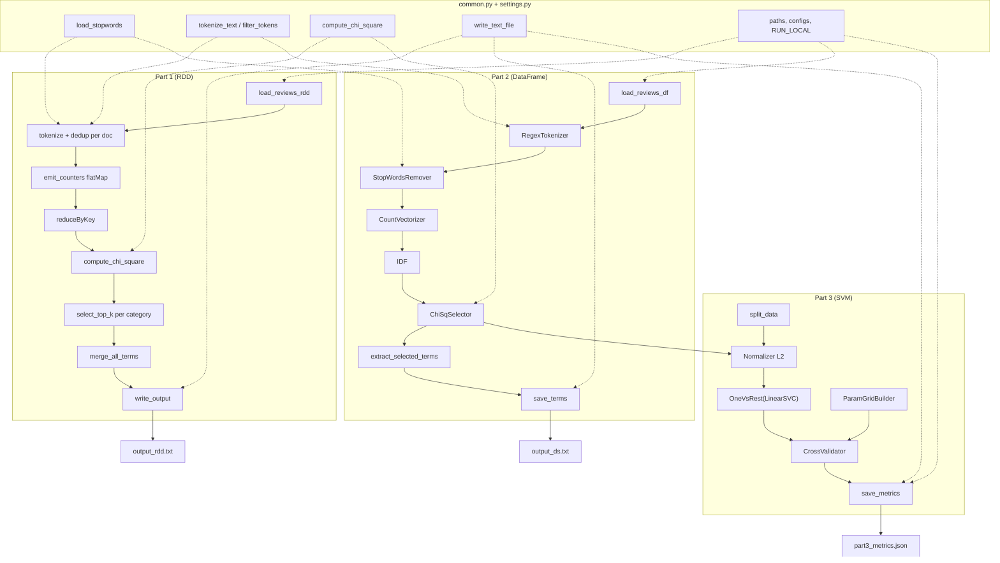

# Assignment 2 : Text Processing and Classification using Apache Spark

**Group 58 :**  Tomilin Evgenii, Sajan Sonu, Puthumana Kudiyirikkal Neeraj, Taikandi Mohammed Muhammed Musthaq, Krishnan Karun

**Date:** May 2026

---

## 1. General description

Assignment 2 consists of three parts: 
- Re-implementation of Assignment 1 chi-square feature selection using Apache Spark RDDs (Part 1),
- construction of a TF-IDF weighted vector space pipeline with Spark  ML (Part 2),
- Training of a multi-class SVM text classifier with grid search over hyperparameters (Part 3).
Each part is split into execution steps and has relevant code section in /src and description in this document. As assignment suggests, code was debugged locally and then run on cluster, so two run modes were implemented.

### Project structure

```text
Task2/
├── data/                        # Local dev data location
│   ├── extract_sample.sh        # Pull 5k records from HDFS for local dev
│   ├── reviews_devset_5k.json   # 5000-record local dev sample (gitignored)
│   └── stopwords.txt            # Local stopwords copy (gitignored)
│
├── src/
│   ├── settings.py              # Paths, constants, Spark configs, LOCAL_SPARK_RAM
│   ├── common.py                # shared routines _load_text_rdd, load_stopwords, tokenize, chi-square, write_text_file
│   ├── requirements.txt         # common dependencies versions file, pyspark==4.1.1
│   │
│   ├── part1_01_load.py         # Load JSON as RDD of (category, reviewText)
│   ├── part1_02_tokenize.py     # Tokenization + stopword filter + dedup per doc
│   ├── part1_03_chi_square.py   # Chi-square via single reduceByKey pass + sentinel counters
│   ├── part1_04_aggregate.py    # Top-k selection per category + alphabetical merge
│   ├── part1_05_output.py       # Format output via write_text_file (local or HDFS)
│   ├── part1_06_runner.py       # Part 1 orchestrator
│   │
│   ├── part2_01_load.py         # Re-export load_reviews_df from common
│   ├── part2_02_tokenizer.py    # RegexTokenizer with Task 1 delimiter pattern
│   ├── part2_03_stopwords.py    # StopWordsRemover + 1-char filter (a-z added)
│   ├── part2_04_vectorizer.py   # CountVectorizer (no vocab cap)
│   ├── part2_05_idf.py          # IDF estimator
│   ├── part2_06_chi_selector.py # ChiSqSelector (2000 top features)
│   ├── part2_07_pipeline.py     # StringIndexer + 5-stage pipeline, fit
│   ├── part2_08_output.py       # Extract vocab from fitted model, save output_ds.txt
│   ├── part2_09_runner.py       # Part 2 orchestrator
│   │
│   ├── part3_01_data_split.py   # randomSplit (70/15/15, seed=42)
│   ├── part3_02_normalizer.py   # L2 vector normalizer
│   ├── part3_03_svm_estimator.py # LinearSVC wrapped in OneVsRest
│   ├── part3_04_pipeline.py     # Full pipeline: Part 2 + Normalizer + OneVsRest
│   ├── part3_05_grid_builder.py # 24-config ParamGrid (chi-sq x regParam x std x maxIter)
│   ├── part3_06_cross_validator.py # 2-fold CrossValidator, parallelism=2
│   ├── part3_07_evaluator.py    # MulticlassClassificationEvaluator (F1)
│   ├── part3_08_output.py       # Save metrics to JSON via write_text_file
│   ├── part3_09_runner.py       # Part 3 orchestrator
│   │
│   ├── run_part1.sh             # Shell wrapper: venv auto-detect, PYSPARK_PYTHON local-only
│   ├── run_part2.sh             # Shell wrapper for part 2
│   ├── run_part3.sh             # Shell wrapper for part 3
│   └── run_all.sh               # Calls run_part1 -> run_part2 -> run_part3 sequentially
│
├── output/
│   ├── output_rdd.txt           # Part 1 results (generated)
│   ├── output_ds.txt            # Part 2 results (generated)
│   └── part3_metrics.json       # Part 3 grid search results (generated)
│
└── presentation/
    └── presentation.md          # Report source
```

Datasets used: augmented (DEV) Amazon Review Dataset 2014 split (~58 MB, ~79k reviews) on HDFS (/dic_shared/amazon-reviews/full/reviews_devset.json). For local tests a 5k head of the same dataset was pulled, see (\data\extract_sample.sh) 

### Notes on project running 

To alter execution mode use RUN_LOCAL environment variable.

```sh
RUN_LOCAL=false ./src/run_all.sh # run on LBD
```
Resulting files are written to /output in local mode and to HDFS in LBD.
For cluster files should be obtained using the below script (default set paths).
```sh
hdfs dfs -getmerge /user/<YOUR_USERNAME>/DIC_Task2/output/output_rdd.txt output_rdd.txt
hdfs dfs -getmerge /user/<YOUR_USERNAME>/DIC_Task2/output/output_ds.txt output_ds.txt
hdfs dfs -getmerge /user/<YOUR_USERNAME>/DIC_Task2/output/part3_metrics.json part3_metrics.json
```
####  Long runs status checks
Usually to track progress spark has fancy webpage, but it seems to be inaccessible for LBD *clustered* runs. To check running task is alive , observe spark heartbeats which it sends once half a minute to shell. To verify active status use grep: 
```sh
yarn application -list 2>/dev/null | grep e12533692 # where e12533692 is replaced by your user name
```
For *local* runs webserver is on *4040* port.

#### Cluster execution notes
All tasks runners are wrapped into .sh. To run tasks individually use run_part#.sh, setting RUN_LOCAL=false .
Jobs submitted via `spark-submit --master yarn --deploy-mode cluster`. All source modules shipped via `--py-files`, stopwords via `--files`. 

---

## 2. Problems Overview

Three tasks share a common preprocessing pipeline but differ in implementation approach and end goal:

- **Part 1**: replicate Assignment 1 chi-square term selection using RDD transformations. Output top-75 terms per product category and a merged dictionary, matching Task 1 format exactly.

- **Part 2**: build a Spark ML transformation pipeline (tokenization, stopword removal, CountVectorizer, IDF, ChiSqSelector) to select the 2000 most discriminative terms across all categories using DataFrame API.

- **Part 3**: extends Part 2 pipeline with L2 normalization and a multi-class SVM classifier (OneVsRest + LinearSVC). Perform grid search over 24 hyperparameter combinations to find the best configuration, evaluated by F1 score.

All parts use the same preprocessing rules as Assignment 1: whitespace/punctuation
tokenization, casefolding, stopword filtering (591 stopwords), and single-character
token removal.

---

## 3. Methodology and Approach

### 3.1 Pipeline overview



*note:* Part 1 uses a separate RDD-only path (single reduceByKey pass for all chi-square counters, collected to driver for scoring, top-75 heaps per category).

### 3.2 Part 1 ( RDD chi-square )

Document-presence semantics: terms deduplicated per review before counting. Counters emitted as `((prefix, key), 1)` tuples in a single flatMap pass:

- `("__N__", "__N__")` total documents
- `("__NC__", category)` documents per category
- `("__NT__", term)` documents containing term
- `(category, term)` documents in category with term

One `reduceByKey` aggregates all four counter types. Chi-square computed on 2x2 contingency table, then top-75 per category selected via sort + limit.

### 3.3 Part 2 (Spark ML pipeline)

Five feature stages, plus a StringIndexer for the label column, chained into a single `pyspark.ml.Pipeline` and fit on the review DataFrame. Terms are extracted from the fitted ChiSqSelectorModel by mapping `selectedFeatures` indices to CountVectorizerModel vocabulary.

| Stage | Spark class | Type | Comment |
|---|---|---|---|
| Label encoding | `StringIndexer` | Estimator | Maps category strings to numeric labels (0,1,2...) needed by ChiSqSelector and SVM |
| Tokenization | `RegexTokenizer` | Transformer | Splits `reviewText` on Task 1 delimiter pattern, gaps mode, casefolds |
| Stopword removal | `StopWordsRemover` | Transformer | Drops 591 stopwords + single lowercase letters `a`-`z` (1-char filter) |
| Term-frequency vectors | `CountVectorizer` | Estimator | Builds vocabulary from all reviews, outputs sparse term-count vectors per document |
| TF-IDF weighting | `IDF` | Estimator | Down-weights terms that appear in many documents, up-weights rare discriminative terms |
| Feature selection | `ChiSqSelector` | Transformer | Selects top 2000 terms by chi-square score against the category label |

### 3.4 Part 3 (Classification)

Part 3 extends Part2 pipeline (RegexTokenizer → StopWordsRemover → CountVectorizer → IDF → ChiSqSelector + StringIndexer for the label) with (L2 Normalizer and OneVsRest(LinearSVC) ) grid search, parameters:

| Parameter              | Values         | Count  |
| ---------------------- | -------------- | ------ |
| chi-square features    | 2000, 500      | 2      |
| SVM regularization     | 0.01, 0.1, 1.0 | 3      |
| Standardization        | on, off        | 2      |
| Max iterations         | 50, 100        | 2      |
| **Total combinations** |                | **24** |

CrossValidator is set with 2 folds, parallelism 2, seed 42 for reproducibility (settings.py). Training on train+validation split (85%), final evaluation on held-out test set (15%).

## 4. Results

### 4.1 Part 1 (RDD output)

Generated `output_rdd.txt` from full cluster devset (~79k reviews, 58 MB):

- 22 product categories, each with 75 `term:chi2` entries
- 1464 unique terms in merged alphabetical dictionary
- Top term per category selected by document-presence chi-square

Format: `<category> <term>:<score> ...` (75 terms per line) + merged dictionary line.
Matches Assignment 1 output specification. 22 categories cover full product
range of the devset, compared to 3 categories in 5k local sample.

### 4.2 Part 2 (Feature selection)

2000 terms selected by chi-square from full devset via Spark ML pipeline.
Terms ordered by chi-square score (most discriminative first). Output written to
`output_ds.txt`, one term per line.

Top-10 terms: `great`, `good`, `love`, `time`, `work`, `recommend`, `back`,
`easy`, `make`, `bought` — consistent with review-domain language spanning
multiple categories.

### 4.2.1 Comparison with Assignment 1

All three outputs compared below were generated from the same dataset
(`reviews_devset.json`, ~79k reviews, 22 categories).

| Metric | Task 1 (mrjob, devset) | Part 1 (Spark RDD, devset) | Part 2 (Spark ML, devset) |
|---|---|---|---|
| Categories | 22 | 22 | — |
| Merged dict terms | 1464 | 1464 | — |
| Per-category top-k | 75 | 75 | — |
| Global top-k | — | — | 2000 |
| Chi-square semantics | document-presence | document-presence | TF-IDF / discretized |
| Term-set agreement with Task 1 | — | 1464 / 1464 (100%) | 751 / 2000 (37.6%) |
| Score differences | — | 0 | n/a |
| Order-only differences | — | 15 of 22 categories | n/a |

**Part 1** is accurate re-implementation of Task 1. Both use the same token-delimiter pattern, the same 591 stopwords, the same `MIN_TOKEN_LENGTH=2` filter, `set()`-based document deduplication, identical chi-square formula, and identical counters. 

Outputs from both tasks agree on every term and every chi-square score across all 22 categories. 

The only difference is order in 15 of 22 category lines:

Task 1's `reducer_final` sorts by score alone (`sorted(heap, key=lambda x: x[0], reverse=True)`), while Part 1 sorts by `(-score, term)` in `top_k`. 

When multiple terms share the same chi-square value (e.g., `acdelco`, `acura`, and `crv` all at 281.7937 in Automotive), Part1 and Task1 list them in different orders, but the term sets and scores are identical.

**Part 2** uses Spark ML's ChiSqSelector on TF-IDF weighted vectors  :
 - CountVectorizer without `binary=True` produces term-frequency counts;
 - IDF applies continuous weights;
 - ChiSqSelector internally discretizes these into bins before computing chi-square.

Part2 selects 2000 terms globally across all categories rather than 75 per category.
751/2000 terms also appear in Task 1 *per-category* merged dictionary.

The other 1249 are terms that are globally discriminative across all 22 categories but do not reach the top 75 in any single category. This is expected: Part 2 selects by global chi-square, not per-category rank.

Both approaches surface review-domain language (`great`, `good`, `love`, etc.) which appears in all three outputs.

### 4.3 Part 3 (Grid search results)

24-config grid search ran on the full cluster devset (22 categories, ~79k reviews
after train/val/test split, 2-fold CV, parallelism=2, wall time ~7.5 hours).

**Top 5 configurations by validation F1:**

| numTopFeatures | regParam | standardization | maxIter | F1 (val) |
|---|---|---|---|---|
| 2000 | 0.01 | True | 100 | **0.5847** |
| 2000 | 0.01 | True | 50 | 0.5840 |
| 2000 | 0.10 | True | 50 | 0.5775 |
| 2000 | 0.10 | True | 100 | 0.5761 |
| 2000 | 1.00 | True | 50 | 0.5432 |
| ... | | | | |
| 500 | 1.00 | False | 50 | 0.2079 |
| 500 | 1.00 | False | 100 | 0.2081 |

**Best configuration**: 2000 chi-square features, regParam=0.01, standardization=True, maxIter=100. Validation F1 = 0.5847. Final evaluation on the held-out 15% test set yields Test F1 = 0.6078 (log observation).

**Averaged effects:**

| Factor | Level | Mean F1 | Delta |
|---|---|---|---|
| Features | 2000 | 0.5300 | +0.1287 |
| | 500 | 0.4013 | |
| Standardization | on | 0.5130 | +0.0947 |
| | off | 0.4183 | |

### 4.3.1 Local vs. cluster comparison

| Setting | Devset | Categories | Best F1 | Runtime |
|---|---|---|---|---|
| Local (macOS) | 5k reviews | 3 | 0.8691 | ~37 min |
| Cluster (YARN) | ~79k reviews | 22 | 0.5847 | ~7.5 h |

F1 drop from 0.87 (local) to 0.58 (cluster) reflects the difference between a simplified *3-class* problem with *almost no vocabulary overlap* and a *22-class* problem where categories like `CDs_and_Vinyl` vs. `Digital_Music`, or `Baby` vs. `Toys_and_Game`, share vocabulary and are harder to separate.

The 22-category problem has a random baseline of ~4.5%. Cluster F1 of 0.58 is approximately 13x above random, which means the model has learned clear signal despite the higher class count.

### 4.4 Observations

- 2000 chi-square features consistently outperform 500 (F1 gain +0.13).
- Regularization at 0.01 edges out 0.10 on the full problem, unlike the local run where 0.10 won, means more classes benefit from less aggressive penalty.
- Standardization improves F1 by ~0.09 this is largest single-parameter effect.
- maxIter=50 is sufficient: at the best config (2000 features, regParam=0.01, std=True), increasing from 50 to 100 iterations adds only +0.0007 F1. Beyond 50 iterations there is no meaningful improvement.
- Test F1 (0.6078) exceeds best CV F1 (0.5847) on the held-out 15% split, confirming no overfitting. The model generalizes slightly better on unseen data than during cross-validation.

## 5. Conclusions

Implemented Spark ML pipeline successfully selects discriminative review terms and trains
multi-class SVM classifiers on both a reduced 3-category sample (F1 0.87) and the
full 22-category development set (CV F1 0.58, Test F1 0.61, 13x above random baseline).

Feature selection at 2000 chi-square terms and L2 standardization are the two
strongest performance drivers. Regularization tuning provides modest gains; the
number of SVM iterations above 50 has no measurable effect.