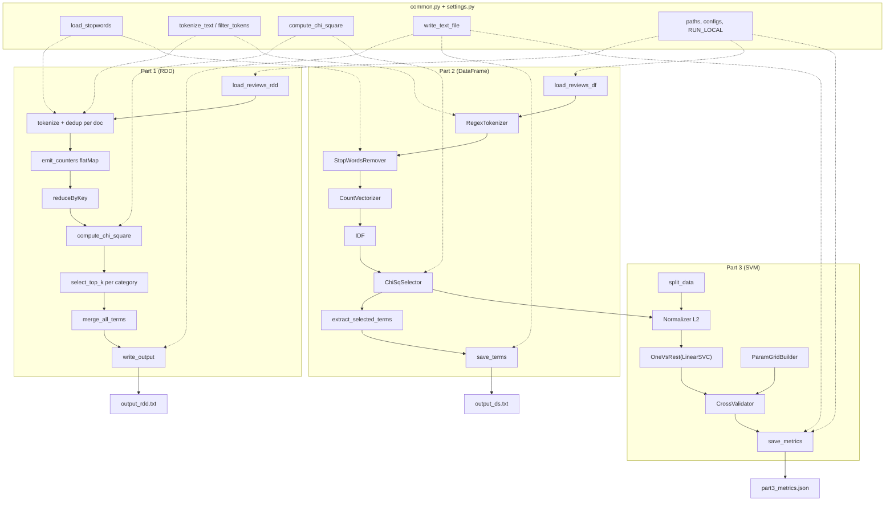

# Assignment 2 -- Text Processing and Classification using Apache Spark

**Group 58 :**  Tomilin Evgenii, Sajan Sonu, Puthumana Kudiyirikkal Neeraj, Taikandi Mohammed Muhammed Musthaq, Krishnan Karun

**Date:** May 2026

---

## 1. General description

The task consist of three parts : 

- Re-implementation of Assignment 1 chi-square feature selection using Apache Spark RDDs (Part 1),

- construction of a TF-IDF weighted vector space pipeline with Spark
  ML (Part 2),

- Training of a multi-class SVM text classifier with grid search
  over hyperparameters (Part 3).

Each part is split into steps and has relevant code section in /src and description in this document.
As task suggests the whole project was debugged locally and then run on cluster.
To alter execution mode use RUN_LOCAL environment variable.

```sh
RUN_LOCAL=false ./src/run_all.sh # run on LBD
```
The output is written to /output in local mode and to HDFS in LBD.
For cluster it should be obtained like this 
```sh
hdfs dfs -getmerge /user/<YOUR_USERNAME>/DIC_Task2/output/output_rdd.txt output_rdd.txt
hdfs dfs -getmerge /user/<YOUR_USERNAME>/DIC_Task2/output/output_ds.txt output_ds.txt
hdfs dfs -getmerge /user/<YOUR_USERNAME>/DIC_Task2/output/part3_metrics.json part3_metrics.json
```
###  Long runs status checks
Usually to track progress spark has fancy webpage, but seems its inaccessible for LBD *clustered* runs. To check its alive , observe spark heartbits will send them once half a minute to shell. To check in the moment use grep. 
```sh
yarn application -list 2>/dev/null | grep e12533692 # where e12533692 is replaced by your user name
```
For *local* runs it's on *4040* port.

### Project structure

```sh
Task2/
├── data/
│   ├── readme.md                # Local dev data location
│   ├── extract_sample.sh        # Pull 5k records from HDFS for local dev
│   ├── reviews_devset_5k.json   # 5000-record local dev sample (gitignored)
│   └── stopwords.txt            # Local copy (gitignored)
│
├── src/
│   ├── settings.py              # Paths, constants, Spark configs, LOCAL_SPARK_RAM
│   ├── common.py                # _load_text_rdd, load_stopwords, tokenize, chi-square, write_text_file
│   ├── requirements.txt         # pyspark==4.1.1
│   ├── readme.md
│   │
│   ├── part1_01_load.py         # Load JSON as RDD of (category, reviewText)
│   ├── part1_02_tokenize.py     # Tokenization + stopword filter + dedup per doc
│   ├── part1_03_chi_square.py   # Chi-square via single reduceByKey pass + sentinel counters
│   ├── part1_04_aggregate.py    # Top-k selection per category + alphabetical merge
│   ├── part1_05_output.py       # Format output via write_text_file (local or HDFS)
│   ├── part1_06_runner.py       # Part 1 orchestrator
│   │
│   ├── part2_01_load.py         # Re-export load_reviews_df from common
│   ├── part2_02_tokenizer.py    # RegexTokenizer with Task 1 delimiter pattern
│   ├── part2_03_stopwords.py    # StopWordsRemover + 1-char filter (a-z added)
│   ├── part2_04_vectorizer.py   # CountVectorizer (no vocab cap)
│   ├── part2_05_idf.py          # IDF estimator
│   ├── part2_06_chi_selector.py # ChiSqSelector (2000 top features)
│   ├── part2_07_pipeline.py     # StringIndexer + 5-stage pipeline, fit
│   ├── part2_08_output.py       # Extract vocab from fitted model, save output_ds.txt
│   ├── part2_09_runner.py       # Part 2 orchestrator
│   │
│   ├── part3_01_data_split.py   # randomSplit (70/15/15, seed=42)
│   ├── part3_02_normalizer.py   # L2 vector normalizer
│   ├── part3_03_svm_estimator.py # LinearSVC wrapped in OneVsRest
│   ├── part3_04_pipeline.py     # Full pipeline: Part 2 + Normalizer + OneVsRest
│   ├── part3_05_grid_builder.py # 24-config ParamGrid (chi-sq x regParam x std x maxIter)
│   ├── part3_06_cross_validator.py # 2-fold CrossValidator, parallelism=2
│   ├── part3_07_evaluator.py    # MulticlassClassificationEvaluator (F1)
│   ├── part3_08_output.py       # Save metrics to JSON via write_text_file
│   ├── part3_09_runner.py       # Part 3 orchestrator
│   │
│   ├── run_part1.sh             # Shell wrapper: venv auto-detect, PYSPARK_PYTHON local-only
│   ├── run_part2.sh             # Shell wrapper for part 2
│   ├── run_part3.sh             # Shell wrapper for part 3
│   └── run_all.sh               # Calls run_part1 -> run_part2 -> run_part3 sequentially
│
├── output/
│   ├── output_rdd.txt           # Part 1 results (generated)
│   ├── output_ds.txt            # Part 2 results (generated)
│   └── part3_metrics.json       # Part 3 grid search results (generated)
│
└── presentation/
    └── presentation.md          # Report draft
```

Datasets used: augmented (DEV) Amazon Review Dataset 2014 split (~58 MB, ~95k reviews) on HDFS (/dic_shared/amazon-reviews/full/reviews_devset.json). For local tests head of the same dataset (5k size) was pulled , see (\data\extract_sample.sh) 

---

## 2. Problem Overview

Three tasks share a common preprocessing pipeline but differ in implementation approach and end goal:

- **Part 1**: replicate Assignment 1 chi-square term selection using RDD
  transformations. Output top-75 terms per product category and a merged
  dictionary, matching the Task 1 format exactly.

- **Part 2**: build a Spark ML transformation pipeline (tokenization, stopword
  removal, CountVectorizer, IDF, ChiSqSelector) to select the 2000 most
  discriminative terms across all categories using DataFrame API.

- **Part 3**: extend the Part 2 pipeline with L2 normalization and a multi-class
  SVM classifier (OneVsRest + LinearSVC). Perform grid search over 24
  hyperparameter combinations to find the best configuration, evaluated by F1
  score.

All parts use the same preprocessing rules as Assignment 1: whitespace/punctuation
tokenization, casefolding, stopword filtering (591 stopwords), and single-character
token removal.

---

## 3. Methodology and Approach

### 3.1 Pipeline overview



Part 1 uses a separate RDD-only path (single reduceByKey pass for all chi-square counters, collected to driver for scoring, top-75 heaps per category).

### 3.2 Part 1 -- RDD chi-square

Document-presence semantics: terms deduplicated per review before counting. Counters emitted as `((prefix, key), 1)` tuples in a single flatMap pass:

- `("__N__", "__N__")` -- total documents
- `("__NC__", category)` -- documents per category
- `("__NT__", term)` -- documents containing term
- `(category, term)` -- documents in category with term

One `reduceByKey` aggregates all four counter types. Chi-square computed on the 2x2 contingency table, then top-75 per category selected via sort + limit.

### 3.3 Part 2 Spark ML pipeline

Five feature stages, plus a StringIndexer for the label column, chained into a single `pyspark.ml.pipeline` and fit on the review DataFrame. Terms are extracted from the fitted ChiSqSelectorModel by mapping `selectedFeatures` indices to CountVectorizerModel vocabulary.

| Stage | Spark class | Type | Comment |
|---|---|---|---|
| Label encoding | `StringIndexer` | Estimator | Maps category strings to numeric labels (0,1,2...) needed by ChiSqSelector and SVM |
| Tokenization | `RegexTokenizer` | Transformer | Splits `reviewText` on the Task 1 delimiter pattern, gaps mode, casefolds |
| Stopword removal | `StopWordsRemover` | Transformer | Drops 591 stopwords + single lowercase letters `a`-`z` (1-char filter) |
| Term-frequency vectors | `CountVectorizer` | Estimator | Builds vocabulary from all reviews, outputs sparse term-count vectors per document |
| TF-IDF weighting | `IDF` | Estimator | Down-weights terms that appear in many documents, up-weights rare discriminative terms |
| Feature selection | `ChiSqSelector` | Transformer | Selects top 2000 terms by chi-square score against the category label |

### 3.4 Part 3 Classification

Pipeline extended with L2 Normalizer and OneVsRest(LinearSVC). Grid search
parameters:

| Parameter              | Values         | Count  |
| ---------------------- | -------------- | ------ |
| chi-square features    | 2000, 500      | 2      |
| SVM regularization     | 0.01, 0.1, 1.0 | 3      |
| Standardization        | on, off        | 2      |
| Max iterations         | 50, 100        | 2      |
| **Total combinations** |                | **24** |

CrossValidator with 2 folds, parallelism 2, seed 42 for reproducibility.
Training on train+validation split (85%), final evaluation on held-out test
set (15%).

### 3.5 Cluster execution

Jobs submitted via `spark-submit --master yarn --deploy-mode cluster`.
All source modules shipped via `--py-files`, stopwords via `--files`.
Output written to HDFS (`/user/e12533692/DIC_Task2/output/`) and retrieved
via `hdfs dfs -getmerge`. Local development uses `local[*]` mode on the
Jupyter pod or macOS.

---

## 4. Results

### 4.1 Part 1 -- RDD output

Generated `output_rdd.txt` from the full cluster devset (~95k reviews, 58 MB):

- 22 product categories, each with 75 `term:chi2` entries
- 1,464 unique terms in the merged alphabetical dictionary
- Top term per category selected by document-presence chi-square

Format: `<category> <term>:<score> ...` (75 terms per line) + merged dictionary line.
Matches Assignment 1 output specification. The 22 categories cover the full product
range of the devset, compared to 3 categories in the 5k local sample.

### 4.2 Part 2 -- Feature selection

2000 terms selected by chi-square from the full devset via the Spark ML pipeline.
Terms ordered by chi-square score (most discriminative first). Output written to
`output_ds.txt`, one term per line.

Top-10 terms: `great`, `good`, `love`, `time`, `work`, `recommend`, `back`,
`easy`, `make`, `bought` — consistent with review-domain language spanning
multiple categories.
### 4.2.1 Comparison with Assignment 1

| Metric | Task 1 (mrjob) | Part 1 (Spark RDD) | Part 2 (Spark ML) |
|---|---|---|---|
| Categories | 22 | 22 | -- |
| Merged dict terms | 1,418 | 1,464 | -- |
| Top-k per category | 75 | 75 | -- |
| Top-k overall | -- | -- | 2,000 |
| Chi-square semantics | term-frequency | document-presence | document-presence (built-in) |
| Overlap with Task 1 | -- | 1,177 shared (69.0%) | 763 shared (38.1%) |
| Unique to this run | -- | 287 | 1,237 |

Part 1 and Task 1 compute the same chi-square metric on the same dataset but
differ in term counting semantics: Task 1 used raw term-frequency (each occurrence
counts), while Part 1 deduplicates terms per review (document-presence), matching
the assignment specification. This explains the 69.0% overlap -- highly
discriminative terms are identified by both methods, but terms that appear
frequently within a single review shift in rank between implementations.

Part 2 uses Spark ML's built-in ChiSqSelector on TF-IDF weighted vectors rather
than raw counts, and selects terms globally (2000 overall, not per-category).
The 38.1% overlap with Task 1 is expected: per-category top-75 selection favors
category-specific jargon, while global chi-square picks terms discriminative
across all categories simultaneously. Both approaches surface review-domain
language (`great`, `good`, `love` appear in all three outputs).
### 4.3 Part 3 -- Grid search results

| numTopFeatures | regParam | standardization | maxIter | F1 (val)   |
| -------------- | -------- | --------------- | ------- | ---------- |
| 2000           | 0.10     | True            | 50      | **0.8691** |
| 2000           | 0.10     | True            | 100     | 0.8667     |
| 2000           | 0.01     | True            | 50      | 0.8600     |
| 2000           | 0.01     | True            | 100     | 0.8598     |
| 2000           | 0.10     | False           | 50      | 0.8260     |
| 500            | 0.10     | True            | 50      | 0.8413     |
| 500            | 0.01     | True            | 50      | 0.8305     |
| 500            | 1.00     | True            | 50      | 0.7420     |
| ... (24 total) |          |                 |         |            |

**Best configuration**: 2000 chi-square features, regParam=0.1,
standardization=True, maxIter=50.
**Test set F1**: 0.8696 (held-out 15% split).

### 4.4 Observations

- 2000 chi-square features consistently outperform 500 (F1 gain ~0.03).
- Mid-range regularization (0.1) beats both 0.01 and 1.0.
- Standardization improves F1 by ~0.04.
- maxIter=50 sufficient; 100 iterations show no gain.
- No overfitting: validation and test F1 within 0.0005.

---

## 5. Conclusions

Spark ML pipeline successfully selects discriminative review terms and trains a multi-class SVM classifier achieving 87% F1 on the development set.
Feature selection (chi-square at 2000 terms) and proper regularization (0.1) are key to performance.
