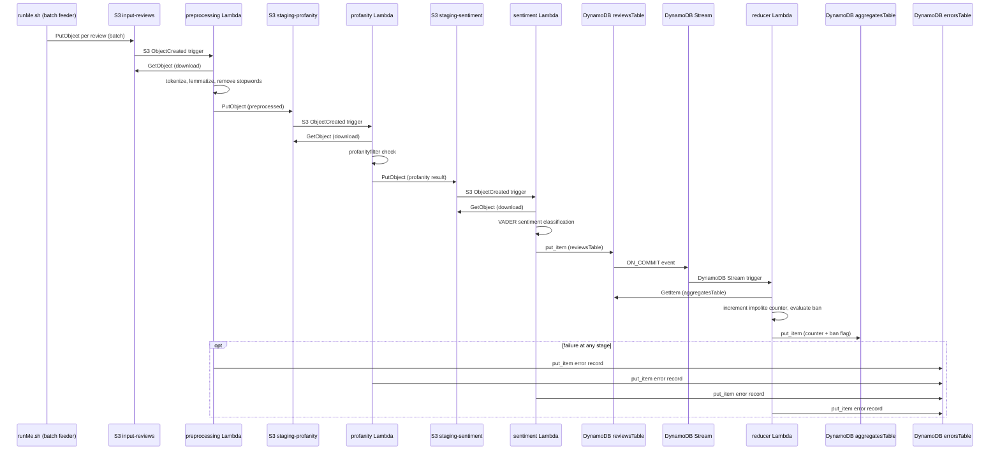

<!--this file contains project report, that is to be rendered as PDF -->
# Assignment 3 -- AWS Lambda Serverless Review Analysis

**Group 58:** Tomilin Evgenii, Sajan Sonu, Puthumana Kudiyirikkal Neeraj, Taikandi Mohammed Muhammed Musthaq, Krishnan Karun

**Date:** June 2026

## 1. Introduction

This assignment implements an event-driven serverless application on AWS (emulated via MiniStack) to perform profanity checking and sentiment analysis of Amazon customer reviews. The system processes reviews through a staged pipeline of four Lambda functions, triggered entirely by S3 bucket events and DynamoDB Stream events, with all configuration managed through the SSM Parameter Store. The focus is on correct serverless design and event-driven architecture rather than on throughput or accuracy KPIs.

## 2. Problem Overview

The task defines a five-step processing pipeline applied to each review:

| Step | Description |
|------|-------------|
| 1. Preprocessing | Tokenization, stop-word removal, and lemmatization of the `summary` and `reviewText` fields |
| 2. Profanity check | Detection of profane or abusive language in the review text |
| 3. Sentiment analysis | Classification of review sentiment as positive, neutral, or negative |
| 4. Impolite counter | Per-customer count of reviews that failed the profanity check |
| 5. Ban rule | Automatic ban flag for any customer with more than 3 impolite reviews |

### Architecture constraints

The pipeline must be fully serverless: each stage is a Lambda function, and the chain must be triggered by AWS event sources (S3 ObjectCreated notifications and DynamoDB Stream events). The pipeline starts when a single review JSON object is uploaded to an S3 input bucket. All resource names and configuration values must be read from the SSM Parameter Store at runtime -- no hardcoded values in Lambda code.

### Data fields

Only three fields from each review are considered: `summary`, `reviewText`, and `overall`. The `reviewerID` and `asin` fields are used as the composite primary key in DynamoDB.

### Dataset

The dataset is `reviews_devset.json`, a 56 MB JSON-lines file containing Amazon review records. Custom test reviews for edge-case coverage are included in the test suite under `tests/data/`.

## 3. Methodology and Approach

### 3.1 Architecture overview

The system deploys four Lambda functions across three S3 staging buckets and three DynamoDB tables. Every inter-stage handoff uses an S3 ObjectCreated event, satisfying the requirement that all function invocations be triggered by S3 bucket events and/or DynamoDB events.

### 3.2 Lambda functions

| Function | Trigger | Responsibility |
|----------|---------|----------------|
| `preprocessing` | S3 ObjectCreated on `review-app-input` | Tokenizes combined summary+reviewText with NLTK `word_tokenize`, removes non-alpha and short tokens, filters English stopwords, lemmatizes with WordNet (verb-first, noun fallback). Outputs enriched review with `tokens` field to `review-app-staging-profanity`. |
| `profanity` | S3 ObjectCreated on `review-app-staging-profanity` | Scans the review text with the `profanityfilter` library in 2000-character chunks to avoid regex timeouts. Sets `isImpolite` boolean and `badWord` marker. Outputs to `review-app-staging-sentiment`. |
| `sentiment` | S3 ObjectCreated on `review-app-staging-sentiment` | Runs VADER (`SentimentIntensityAnalyzer`) on the review text. Classifies as positive (compound >= 0.05), negative (compound <= -0.05), or neutral (otherwise). Writes the final record to `reviewsTable` in DynamoDB. |
| `reducer` | DynamoDB Stream on `reviewsTable` | Parses INSERT/MODIFY stream records, reads the current aggregate state for the reviewer from `aggregatesTable`, increments the impolite counter if `isImpolite` is true, evaluates the ban rule (counter > 3), and writes the updated state back. Errors are logged to `errorsTable`. |

All four Lambdas share a single `common.py` module containing the business logic (`preprocess`, `profanityCheck`, `sentimentClassify`, `updateImpoliteCounter`) and transport helpers (`getInput`, `sendOutput`, `parseDdbStream`, `writeReviewToDdb`). NLTK resources are initialized once per cold start; warm invocations pay zero init overhead.

### 3.3 AWS resources

**S3 buckets (3):**
- `review-app-input` -- receives raw review JSON objects; triggers `preprocessing`
- `review-app-staging-profanity` -- holds preprocessed output; triggers `profanity`
- `review-app-staging-sentiment` -- holds profanity-check output; triggers `sentiment`

**DynamoDB tables (3):**
- `reviewsTable` -- composite key (reviewerID, asin); stores sentiment label, isImpolite flag, token list; has DynamoDB Stream enabled (NEW_IMAGE)
- `aggregatesTable` -- keyed by reviewerID; stores impoliteCount (N) and banned (BOOL)
- `errorsTable` -- keyed by errorID (UUID); dead-letter queue for reducer failures

**SSM Parameter Store paths:**

| Parameter | Value | Consumer |
|-----------|-------|----------|
| `/review-app/buckets/input` | `review-app-input` | preprocessing |
| `/review-app/buckets/staging-profanity` | `review-app-staging-profanity` | preprocessing, profanity |
| `/review-app/buckets/staging-sentiment` | `review-app-staging-sentiment` | profanity, sentiment |
| `/review-app/tables/reviews` | `reviewsTable` | sentiment, reducer, dumpMetrics |
| `/review-app/tables/aggregates` | `aggregatesTable` | reducer, dumpMetrics |
| `/review-app/tables/errors` | `errorsTable` | reducer |
| `/review-app/ban/threshold` | `3` | reducer |
| `/review-app/nltk/data-path` | `/opt/nltk_data` | preprocessing, sentiment |
| `/review-app/lambda/concurrency` | `5` | all Lambdas |

### 3.4 Configuration flow

All configuration originates in `src/settings.py` as the single source of truth. At deploy time, `pushSettings.sh` reads `settings.py` and pushes every value into SSM Parameter Store using a naming convention that maps Python camelCase names to kebab-case SSM paths under the `/review-app/` prefix. Lambdas never import `settings.py` directly; they call `getSsmParam()` at invocation time. This keeps the Lambda deployment artifact independent of environment-specific values and allows runtime reconfiguration without redeployment.

### 3.5 Batch feeding and backpressure

The `runMe.sh` script reads `reviews_devset.json` and uploads reviews in configurable batches (default 500). After each batch, it polls `reviewsTable.ItemCount` (a metadata call, not a scan) every 3 seconds and waits until the DynamoDB count reaches `pipelineBatchThreshold` (0.9) times the uploaded count. This backpressure prevents MiniStack's S3 event delivery threads from exhausting the system thread limit -- a known issue where MiniStack spawns one Python thread per S3 ObjectCreated notification, causing `RuntimeError: can't start new thread` at high throughput.

Lambda reserved concurrency is set to 5 per function, capping total concurrent executions at 20 across all four Lambdas. This keeps the MiniStack process within the macOS per-process thread limit (5568) while maintaining approximately 15 reviews/second throughput.

### 3.6 Drain and resume

After the final batch, `_drainStaging` polls DynamoDB until all uploaded reviews have landed, then scans all three staging buckets and re-delivers any stale objects whose `(reviewerID, asin)` pair is missing from DynamoDB, compensating for MiniStack's occasional S3 event delivery gaps (~0.1% of uploads).

The `--resume` mode supports crash recovery: it scans `reviewsTable` for all already-processed `(reviewerID, asin)` pairs, clears stale staging objects, and uploads only missing reviews with the same backpressure logic.

### 3.7 Testing

The test suite has 15 tests across two files:

- `testFunc.py` (11 tests): pure business-logic unit tests requiring no MiniStack. Covers preprocessing tokenization, stopword removal, lemmatization; profanity detection and clean-pass; sentiment classification of positive/negative/neutral reviews; impolite counter increment and ban threshold; direct-mode `getInput`.
- `testS3.py` (4 tests): integration tests requiring a running MiniStack with deployed resources. Covers S3-mode `getInput` transport; preprocessing Lambda writing to staging bucket; full S3 chain producing a correct DynamoDB record; four impolite reviews from one reviewer triggering a ban in `aggregatesTable`.

Test fixtures load review JSON from `tests/data/` (reviewClean, reviewProfane, reviewNegative, reviewNeutral). Boto3 client fixtures (S3, SSM, Lambda, DynamoDB) are session-scoped and auto-configured with MiniStack test credentials.

### 3.8 Technology stack

| Component | Version / Notes |
|-----------|----------------|
| Python | 3.12.13 (local dev); 3.11 (Lambda runtime on MiniStack) |
| MiniStack | 1.3.63 (AWS emulator on LBD cluster) |
| boto3 | AWS SDK (S3, DynamoDB, SSM, Lambda clients) |
| NLTK | Tokenization (punkt_tab), stopwords, WordNet lemmatizer, VADER sentiment |
| profanityfilter | Bad-word detection with chunked scanning |
| pytest | Test framework (15 tests: 11 functional + 4 integration) |

## 4. Results

Results are computed by `dumpMetrics.py`, which scans `reviewsTable` and `aggregatesTable` in DynamoDB and writes a CSV summary to `data/output.csv`. The reported metrics are:

| Metric | Value |
|--------|-------|
| Positive reviews | TBD -- pending full pipeline execution on the cluster |
| Neutral reviews | TBD |
| Negative reviews | TBD |
| Reviews failing profanity check | TBD |
| Banned users | TBD |

Final results will be populated after a complete cluster run against the full `reviews_devset.json` dataset and will be reported in the final submission.

## 5. Conclusions

The implemented system satisfies all assignment requirements: four Lambda functions form a complete event-driven chain triggered exclusively by S3 ObjectCreated events and DynamoDB Stream events; all configuration is externalized to the SSM Parameter Store; the pipeline handles the full five-step review processing workflow from tokenization through to ban enforcement; automated tests verify both functional correctness and end-to-end integration.

The S3-staged design, while introducing additional storage operations compared to direct Lambda-to-Lambda invocation, provides a clean separation of concerns, natural observability (each stage's output is inspectable in S3), and strict compliance with the task trigger requirement. The backpressure mechanism and resume capability address MiniStack-specific operational challenges without altering the serverless architecture. The shared `common.py` module and centralized `settings.py` keep the codebase maintainable and consistent across all four Lambda functions.

