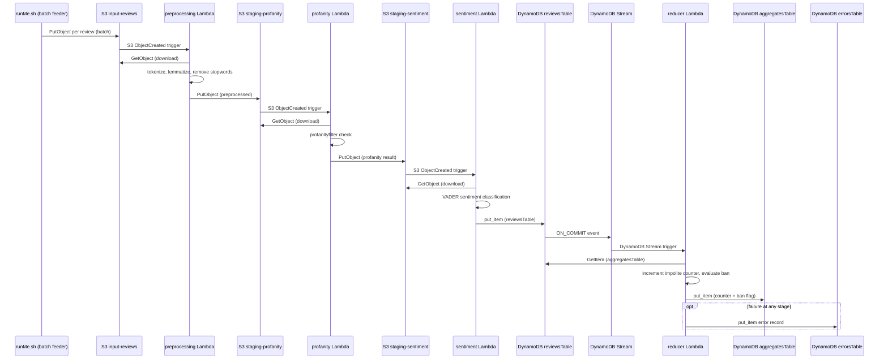
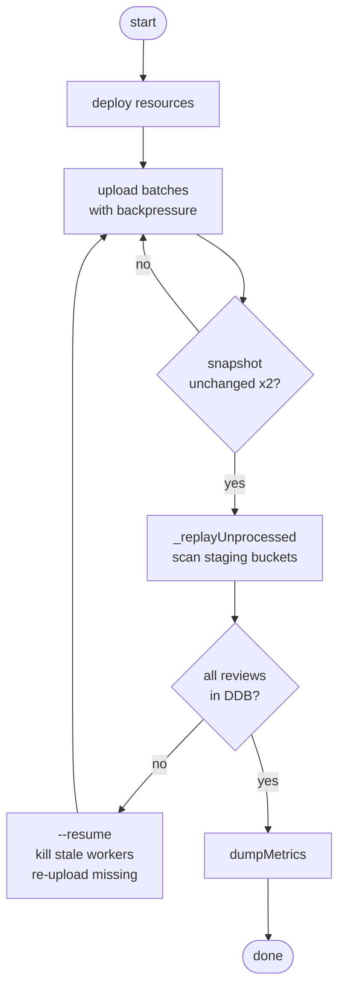

<!--this file contains project report, that is to be rendered as PDF -->
# Assignment 3 -- AWS Lambda Serverless Review Analysis

**Group 58:** Tomilin Evgenii, Sajan Sonu, Puthumana Kudiyirikkal Neeraj, Taikandi Mohammed Muhammed Musthaq, Krishnan Karun

**Date:** June 2026

## 1. Introduction

This assignment implements an event-driven serverless application on AWS (emulated via MiniStack) to perform profanity checking and sentiment analysis of Amazon customer reviews.
System processes reviews through a staged pipeline of four Lambda functions, triggered entirely by S3 bucket events and DynamoDB stream events, with all configuration managed through the SSM parameter store. Project is optimized per task requirements and focused on throughput or accuracy KPIs.

## 2. Problem Overview

Task description requires a five-step processing pipeline applied to each review:

| Step | Description |
|------|-------------|
| 1. Preprocessing | Tokenization, stop-word removal, and lemmatization of the `summary` and `reviewText` fields |
| 2. Profanity check | Detection of profane or abusive language in the review text |
| 3. Sentiment analysis | Classification of review sentiment as positive, neutral, or negative |
| 4. Impolite counter | Per-customer count of reviews that failed the profanity check |
| 5. Ban rule | Automatic ban flag for any customer with more than 3 impolite reviews |

### Architecture constraints

#### from task description :
 - pipeline must be fully serverless: 
 - each stage is a Lambda function
 - chain must be triggered by AWS event sources (S3 ObjectCreated notifications and DynamoDB Stream events).
 - pipeline starts when a single review JSON object is uploaded to an S3 input bucket
 - All resource names and configuration values must be read from the SSM Parameter Store at runtime -- no hardcoded values in Lambda code.

#### as implemented:

| # | Requirement | Implementation |
|---|-------------|----------------|
| 1 | At least three Lambda functions (preprocessing, profanity-check, sentiment-analysis) | Four Lambdas deployed: preprocessing, profanity, sentiment, plus reducer for steps 4-5 |
| 2 | Chain starts on S3 object insertion | `runMe.sh` uploads each review as a JSON object to `review-app-input`; S3 ObjectCreated triggers preprocessing |
| 3 | Subsequent invocations triggered by S3 bucket events and/or DynamoDB events | Each inter-stage handoff uses S3 `PutObject` triggering the next Lambda via `LambdaFunctionConfigurations`; the final reducer is triggered by DynamoDB Stream on `reviewsTable` |
| 4 | Consider `summary`, `reviewText`, and `overall` fields | All three fields are preserved through every pipeline stage via dict spread (`{**review, ...}`). `summary` and `reviewText` are combined for tokenization, profanity detection, and sentiment analysis; `overall` is carried through the Lambda chain but not stored in the final DynamoDB record (only `reviewerID`, `asin`, `sentiment`, `isImpolite`, `badWord`, and `tokens` are persisted) |
| 5 | Configuration from SSM Parameter Store | `pushSettings.sh` reads `settings.py` and pushes all values to SSM under `/review-app/`; every Lambda calls `getSsmParam()` at invocation time |
| 6 | Automated integration tests for all five pipeline steps | 15 pytest tests: 11 functional (pure logic) + 4 integration (MiniStack end-to-end), covering preprocessing, profanity, sentiment, impolite counting, and ban enforcement |

### Dataset

Dataset for the pipeline is `reviews_devset.json`, published on LBD cluster. The file 56 MB JSON-lines containing selected Amazon review records. It's not cleaned or preprocessed somehow, except removing multi-category review once at start (see --dedup flag in runner)

### Data fields

Three fields from each review are specified by the assignment: `summary`, `reviewText`, and `overall`. 

`summary` and `reviewText` fields are combined for tokenization, profanity detection, and sentiment analysis. 

`overall` rating is preserved through Lambda chain via dict spread and accumulated in db to calculate metrics. 

`reviewerID` and `asin` fields are used as the composite primary key in DynamoDB.

## 3. Methodology and Approach

### 3.1 Architecture overview

Runner deploys four Lambda functions chained by three S3 staging buckets and finishing in DynamoDB . Every inter-stage event transfer uses an S3 ObjectCreated event, satisfying original requirement.

This is normally not needed, direct call with final step as persist is enough to solve the problem . Direct calls are faster (no event routine) but task explicitly requires S3/DynamoDb messaging, so sequence as below.

DLQ is implemented only for last step (opt block) because we have implicit state storage as buckets and replay anyway (see comments below). The only place where losses can possibly occur is last save step in DynamoDB. (never happen actually) 

### 3.2 Lambda functions

| Function | Trigger | Responsibility |
|----------|---------|----------------|
| `preprocessing` | S3 ObjectCreated on `review-app-input` | Tokenizes combined summary+reviewText with NLTK `word_tokenize`, removes non-alpha and short tokens, filters English stopwords, lemmatizes with WordNet (verb-first, noun fallback). Outputs enriched review with `tokens` field to `review-app-staging-profanity`. |
| `profanity` | S3 ObjectCreated on `review-app-staging-profanity` | Scans the review text with the `profanityfilter` library in 2000-character chunks to avoid regex timeouts. Sets `isImpolite` boolean and `badWord` marker. Outputs to `review-app-staging-sentiment`. |
| `sentiment` | S3 ObjectCreated on `review-app-staging-sentiment` | Runs VADER (`SentimentIntensityAnalyzer`) on the review text. Classifies as positive (compound >= 0.05), negative (compound <= -0.05), or neutral (otherwise). Writes the final record to `reviewsTable` in DynamoDB. |
| `reducer` | DynamoDB Stream on `reviewsTable` | Parses INSERT/MODIFY stream records, reads the current aggregate state for the reviewer from `aggregatesTable`, increments the impolite counter if `isImpolite` is true, evaluates the ban rule (counter > 3), and writes the updated state back. Errors are logged to `errorsTable`. |

All four Lambdas share a single `common.py` module containing the business logic (`preprocess`, `profanityCheck`, `sentimentClassify`, `updateImpoliteCounter`) and transport helpers (`getInput`, `sendOutput`, `parseDdbStream`, `writeReviewToDdb`). NLTK resources are initialized once per cold start; warm invocations pay zero init overhead.

### 3.3 MiniStack resources

**S3 buckets (3):**
- `review-app-input` -- receives raw review JSON objects; triggers `preprocessing` via S3 ObjectCreated notification. EventBridge is also enabled on this bucket (`EventBridgeConfiguration: {}`) as recommended in the assignment Tips & Tricks, though the primary trigger path uses direct `LambdaFunctionConfigurations`.
- `review-app-staging-profanity` -- holds preprocessed output; triggers `profanity`
- `review-app-staging-sentiment` -- holds profanity-check output; triggers `sentiment`

**DynamoDB tables (3):**
- `reviewsTable` -- composite key (reviewerID, asin); stores sentiment label, isImpolite flag, token list; has DynamoDB Stream enabled (NEW_IMAGE)
- `aggregatesTable` -- keyed by reviewerID; stores impoliteCount (N) and banned (BOOL)
- `errorsTable` -- keyed by errorID (UUID); dead-letter queue for reducer failures

**SSM Parameter Store paths:**

| Parameter | Value | Consumer |
|-----------|-------|----------|
| `/review-app/buckets/input` | `review-app-input` | preprocessing |
| `/review-app/buckets/staging-profanity` | `review-app-staging-profanity` | preprocessing, profanity |
| `/review-app/buckets/staging-sentiment` | `review-app-staging-sentiment` | profanity, sentiment |
| `/review-app/tables/reviews` | `reviewsTable` | sentiment, reducer, dumpMetrics |
| `/review-app/tables/aggregates` | `aggregatesTable` | reducer, dumpMetrics |
| `/review-app/tables/errors` | `errorsTable` | reducer |
| `/review-app/ban/threshold` | `3` | reducer |
| `/review-app/nltk/data-path` | `/opt/nltk_data` | preprocessing, sentiment |
| `/review-app/lambda/concurrency` | `5` | all Lambdas |

### 3.4 Configuration flow

All configuration originates in `src/settings.py` as the single source of truth. At deploy time, `pushSettings.sh` reads `settings.py` and pushes every value into SSM Parameter Store using a naming convention that maps Python camelCase names to kebab-case SSM paths under the `/review-app/` prefix. Lambdas never import `settings.py` directly; they call `getSsmParam()` at invocation time. This keeps the Lambda deployment artifact independent of environment-specific values and allows runtime reconfiguration without redeployment.

### 3.5 Batch feeding and backpressure

It turns out that Ministack:

a) runs in a single PID spawning sub process\
b) does not free lambdas resources correctly.\
c) doesn't autobalance on input, hits thread limit and discards events

All these problems require extra balancing that implemented as below

`runMe.sh` script reads `reviews_devset.json` and uploads reviews in configurable batches (default 500). After each batch, it polls `reviewsTable.ItemCount` every 3 seconds and waits until the DynamoDB count reaches `pipelineBatchThreshold` (0.9) times the uploaded count. 

This backpressure prevents MiniStack's S3 event delivery threads from exhausting the system thread limit , it is seen as `RuntimeError: can't start new thread` at high throughput.
And usually happens when Ministack
spawns next Python thread per S3 ObjectCreated notification.

Lambda reserved concurrency is set to 5 per function, capping total concurrent executions at 20 across all four Lambdas. 
These numbers keeps the MiniStack process within the macOS per-process thread limit  with reasonable speed, and should be adjusted in settings for other platforms. Actual sustained throughput measured is ~8.5 reviews/second.

### 3.6 Drain and resume

During all experiments, roughly 0.1% of events just disappear, for no reason. We could not isolate problem , so added replaying routine to compensate losses. The event is in S3 but it just not fired next. 

After the final batch, `_replayUnprocessed` polls DynamoDB until all uploaded reviews have landed, then scans all three staging buckets and re-delivers any stale objects whose `(reviewerID, asin)` pair is missing from DynamoDB. 

Runner supports `--resume` mode for crash recovery: it scans `reviewsTable` for all already-processed `(reviewerID, asin)` pairs, clears stale staging objects, and uploads only missing reviews with the same backpressure logic.

A convergence-based pipe breaker acts as the pipeline's heartbeat monitor, polling `reviewsTable` and `aggregatesTable` item counts in a loop. When the same snapshot stares back twice in a row, the pipeline declares convergence -- either every review found its way home, or MiniStack quietly went on strike. No fixed timeouts, no blind hope: just a data-driven shrug that says "nothing is moving, time to replay or resume."

### 3.7 Testing

There are 15 unit tests folded in two files:

`testFunc.py` (11 tests):covers lambdas and general logic unit tests requiring no MiniStack. 

`testS3.py` (4 tests): integration tests requiring a running MiniStack with deployed resources.
Verifies transport, writing to bucket, writing DynamoDB, impolite ban

Tests require JSON in `tests/data/` and auto-configured with MiniStack test credentials.

### 3.8 Technology stack

| Component | Version / Notes |
|-----------|----------------|
| Python | 3.12.13 (local dev); 3.11 (Lambda runtime on MiniStack) |
| MiniStack | 1.3.63 (AWS emulator on LBD cluster); ephemeral -- all resources must be recreated on restart |
| boto3 | AWS SDK (S3, DynamoDB, SSM, Lambda clients) |
| NLTK | Tokenization (punkt_tab), stopwords, WordNet lemmatizer, VADER sentiment; data pre-downloaded and bundled in Lambda ZIP as recommended in Tips & Tricks |
| profanityfilter | Bad-word detection with chunked scanning (foreced 2000-char windows to avoid regex timeouts, there are big reviews) |
| pytest | Test framework (15 tests: 11 functional + 4 integration) |
| awscli | AWS CLI for resource management in `runMe.sh` and `pushSettings.sh` |

### 3.9 Deployment features
NLTK corpora (`punkt_tab`, `stopwords`, `wordnet`, `vader_lexicon`) are pre-downloaded and included in each Lambda's ZIP archive under `/opt/nltk_data`, following the pattern described in Tips & Tricks.

`STAGE=local` and `MINISTACK_ENDPOINT` environment variables are set on every Lambda at deploy time, so shared `common.py` module can resolve MiniStack endpoint <i>without hardcoded</i> values.

Lambda ZIP archives include `handler.py`, `common.py`, `settings.py`, and pip dependencies installed into a `package`/ subdirectory akin to structure in tutorial .

## 4. Results

Results are computed by `dumpMetrics.py`, which scans `reviewsTable` and `aggregatesTable` in DynamoDB then writes a CSV summary to `data/output.csv`. 

Two sentiment classifications are reported:
 - **VADER-assessed**  algorithmic, from review text)
 - **user-marked**  original `overall` from JSON ( 1-2:negative, 3:neutral, 4-5:positive). 
 
Both labels are stored in each DynamoDB record.

| Metric | Value |
|--------|-------|
| **VADER-assessed sentiment** | |
| Positive reviews | 67520 |
| Neutral reviews | 1573 |
| Negative reviews | 9734 |
| **User-marked sentiment (overall)** | |
| Positive reviews | 62196 |
| Neutral reviews | 6644 |
| Negative reviews | 9989 |
| **Profanity and bans** | |
| Reviews failing profanity check | 3126 |
| Banned users | 1 |
| Banned user IDs | A320TMDV6KCFU |

### Duplicate analysis

The dataset contains 78829 lines yielding 78827 unique `(reviewerID, asin)` pairs. Two pairs appear twice:

| # | reviewerID | asin | Line | Category |
|---|-----------|------|------|----------|
| 1 | A1MACFR0X42D8E | B00466H3MM | 23159 | Book |
| 1 | A1MACFR0X42D8E | B00466H3MM | 41549 | Kindle_Store |
| 2 | A2SB75CW5MXA1P | B005ADNUIG | 32795 | Sports_and_Outdoor |
| 2 | A2SB75CW5MXA1P | B005ADNUIG | 47533 | Clothing_Shoes_and_Jewelry |

All nine fields in json are identical within each pair **except `category`**. 
These records are not data quality errors. They are legitimate multi-category entries where the same product (asin) is listed under two product categories in Amazon's catalog.

The same review by the same reviewer is therefore emitted twice with different category labels. 

Problem at write time: `reviewsTable` uses composite primary key `(reviewerID, asin)`, so the second write of each pair overwrites the first. The earlier category per pair is silently discarded. This does not affect sentiment or profanity counts because all other fields are identical, but spoils control counts. To avoid this --dedup flag is added to runner.

Wall time: approximately 2.5 hours , estimated processing ~8.5 reviews/second, slowest Lambda stage at ~200ms per review.

## 5. Conclusions

Implementation satisfies assignment requirements: four Lambda functions form a complete event-driven chain triggered exclusively by S3 ObjectCreated events and DynamoDB Stream events.

S3-staged design, introduce additional storage overhead compared to direct Lambda-to-Lambda invocation, but provides a clear intermediate states and monitoring.

Proposed backpressure mechanism and resume capability address MiniStack-specific operational challenges without altering the serverless architecture.
More on challenges tackled and resolved is in `worklog` section of Readme.md 

The shared `common.py` module and centralized `settings.py` keep the codebase maintainable and consistent across all four Lambda functions.

